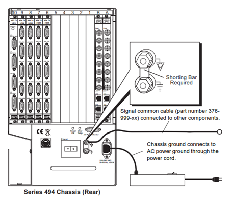
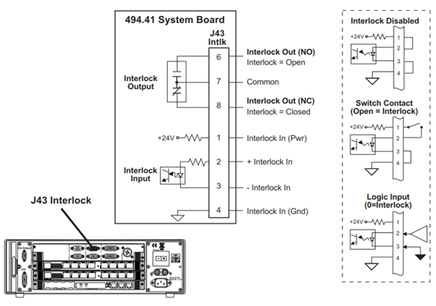

---

---

# FlexTest 控制器配置

## FlexTest控制器概述

### FlexTest系列控制器简介

MTS FT 40/60/100/200控制器主要用于液压伺服测试系统。它通过提供实时闭环控制，和传感器、信号发生器一起驱动各种型号的作动器。

一台FlexTest控制器由以下几部分组成：

* 一个或多个安装有各种494系列控制器板卡的机柜
* 一台安装有MTS控制器软件的工作站电脑

### 控制器的容量

| 参数           | FlexTest 40 | FlexTest 60 | FlexTest 100 | FlexTest 200 |
| -------------- | ----------- | ----------- | ------------ | ------------ |
| 站台数量       | ≤ 2         | ≤ 6         | ≤ 8          | ≤ 8          |
| 控制通道       | ≤ 4         | ≤ 8         | ≤ 16         | ≤ 40         |
| 调理输入通道   | ≤ 12        | ≤ 24        | ≤ 40         | ≤ 80         |
| 非调理输入通道 | ≤ 16        | ≤ 32        | ≤ 64         | ≤ 96         |


### 典型的494系列板卡配置连接 （FT 60/100/200）


### FlexTest控制器的安装

该章节包含了494系列控制器硬件安装的一系列要求。

#### 安装过程
下列流程提供了安装FT控制器的摘要
1. 拆开控制器包装
2. 检查控制器是否受到损坏

````
注意
在运输过程中，有可能会造成控制器电子原件的损坏。使用带有损坏原件的控制器可能会造成人员伤亡或设备损坏。不要尝试使用在运输途中损坏的控制器。如果发生损坏请立即报告货运代理和MTS公司
````

3. 将控制柜搬运到安装位置

````
注意
494.10控制柜大约45kg，494.20大约60kg。如果搬运不当会造成肌肉拉伤和背部不适。
````

````
注意
494.有一个可以拆卸的前机盖，搬运过程中可能会脱落，造成人员受伤。
在搬运494.06时，先拆掉前机盖
````

4. 按照要求连接电缆和电源

````
警告
在系统运行时，如果断开线缆，会造成控制开环，导致系统失控，产生严重的后果。

禁止在通电和带压力的状态下调整线缆。在调整线缆配置后，需要确认已经连接所有线缆，并已经安装应力释放线尾。
````

````
警告
未保护的线缆可能会被液压油、极端温度、应力、锋利的边缘、摩擦等原因造成损坏。损坏的线缆会导致系统失控，产生严重的后果

采用以下措施对线缆进行保护：
* 供电线缆远离液压油和极端温度，这些原因会导致其硬化、失效
* 所有的线缆接头处均应安装应力释放线尾
* 保护所有的线缆远离锋利的边缘和粗糙的表面
* 使用线槽或其他保护装置，防止线缆被重物碾压或挂断494系列硬件
````

#### 主机配置

##### 软件设置

软件用于设置系统中每一块板卡的位置（地址）。控制器软件使用该信息与各板卡进行通讯。其它软件设置用于定义硬件参数

##### 空白面板

为了保证机箱的通风，每一个空位均需要安装一个空白面板

##### 机箱接地

如果机柜没有正确接地，将会导致控制器的功能异常

##### I/O母板设置

494.40 I/O 母版安装前需要进行一系列的设置。包括：
* 通讯地址拨码开关设置（必须）
* 安装桥路补偿电阻（可选）
* 安装旁路标定电阻（可选）

##### 互锁跳线

每一个系统均有一个跳线套装。如果有互锁/急停输入没有使用，需要安装跳线帽，维持这些互锁机构的完整性。

##### 参考资料
 I/O母板的详细设置参看 121页的 “How to Set Up a Model 494.40 I/O Carrier Board” 。

#### 环境要求

| 参数 | 要求 |
|---|---|
|温度 | 5 ~ 40 ℃ |
|湿度 | 5 ~ 85 % R.H.无凝露 |
|海拔 | ≤ 3048m |
|空间要求 | 为了保证通风，所有侧面均需要保证 51mm以上间隙; <BR>背面需要保证15.25cm（6in）以上间隙，方便连接线缆. |

#### 通风要求


````
注意
但机柜的温度过热——超过50℃时，超温指示灯（位于494.06机柜前方）会提示。

如果不立即采取有效的降温措施，会导致机柜部件不可修复的损坏。

但机柜超温指示灯亮起时，需要关闭系统，检查机柜通风、散热风扇和空气过滤器，不要再对系统进行任何其它操作。同时，要保证机柜锁处的环境温度低于40℃，四周与墙面保持至少51mm（2inch）以上的间隙
````

#### 接地要求

首先，请确保电源系统已正确接地。如果机柜没有按照下图所示方式接地，将会导致控制器的功能异常。

机柜中有两个地：机柜地（chassis ground）和信号地（signal common）。在装配时，在外部通过短路片将两个地短接。

````
警告
不正确接地会导致作动器异常运动和电磁兼容问题。作动器的异常运动会导致人员伤害。
````
##### 单个控制器接地

对于单个控制器，利用短接端子将两个地短接，如下图所示。



##### 多个控制器接地

如果将多个控制器安装在同一个机柜里。首先, 移除短接端子，然后将控制器地与机柜导轨相连，如下图所示。


#### 线缆要求

为了满足电磁兼容性的要求，帮助试验台获得更好的性能，MTS建议从MTS订购线缆。安装时，需要确保线缆受正确的保护。

#### UPS系统要求

为了改善系统的安全性，满足 European Machinery Directive的要求，所有使用FT系列控制器的系统均需要集成UPS不间断电源。

````
注意
UPS并不能预防或阻止控制器电子原件损坏，导致的作动器异常运动.
````
UPS的要求:
* UPS必须能够为控制器和其它安全相关的附属设施供电
* UPS需要在断电后，至少提供3分钟以上的供电
* 控制器必须被合理的配置，使得在断电后能够对所控制的设备采取合理的安全措施
* UPS的输入和输出线缆必须包含应力释放和锁紧安全接头
* 在欧盟使用的UPS必须具有CE标识
* UPS系统必须有掉电报警（AC Fail）继电器和低电压报警继电器，并连接到控制器的UPS监控接口

具有掉电报警功能的继电器与控制器连接，能够提供一种安全机制。控制器通过检测到系统掉电，控制试验台安全关闭，缓慢运动到安全位置，然后关闭液压系统。低电压报警继电器通过让控制器获取电池状态，能够提供额外的安全保护机制。

##### UPS规格

MTS系统所使用的UPS必须满足以下规格：

| 项目 | 要求 |
| ------ | ------ |
| 温度 | 5 ~ 40 ℃ |
| 湿度 | 5 ~ 85 % R.H. , 无凝露 |
| 输出电压范围 | 100 ~ 240 V, 交流单相电, 正弦输出 |
| 输入/出频率范围 | 50 ~ 60 Hz |
| 输出负载调节 | ±5 % 标称电压 |
| 切换到电池时间 | 0 s |

##### UPS功率要求

下列功率能够满足电脑和控制器供电，还能提供25%的供电裕量给其它子系统。

| 控制器信号 | 机柜型号 | UPS功率要求 |
|--|-- | -- |
|FlexTest SE | 493.02 | 1200 W |
|FlexTest GT | 493.10 | 2500 W |
|Aero ST | 493.20 | 3500 W |
|FlexTest 40 | 494.04 | 1200 W |
|FlexTest 60 | 494.06 | 1800 W |
|FlexTest 100 | 494.10 | 2500 W |
|FlexTest 200 | 494.20 | 3500 W |


## FlexTest 40 控制器配置

###  FlexTest 40 控制器简介

FlexTest 40控制器是一套全数字化的比例、积分、微分、前馈伺服控制器，在测试系统中能提供一个站台的完整控制。

一个FlexTest 40控制器由以下部分组成
* 一个 安装由控制器硬件的494.04型号的主机箱
* 一台运行有 MTS控制器软件的工作站

### FlexTest 40 控制器能力

| 参数 | FlexTest 40 |
| --- | --- |
| 站台 | 1 |
| 控制通道 | ≤ 4 |
| 调理输入通道 | ≤ 12 |
| 非调理输入通道 | ≤ 16 |

### 494.04型 主机简介
494.04主机有4个VME插槽，其中一个VME插槽用于安装系统板，另两个VME插槽预留给494.40型IO母板使用。主机既可以安装到机柜中，也可直接放置到桌面上，所有的线缆通过后部面板接入。

系统板提供了以下功能：
* 对液压系统油泵（HPU）和分油器（HSM）的控制；
* 提供了互锁输入和输出，通过互锁接口实现与外部设施的的（安全）交互：
	* 将互锁输出继电器与外部设施连接
	* 将外部设备连接到互锁输入对站台进行初始化和程序互锁
* 提供三个光耦隔离的数字输入和数字输出（继电器触点信号），利用系统板可以实现以下功能：
	* 利用数字输入信号触发测试事件（test events）
	* 利用数字输出控制外设

每块494.40 I/O母版。可以安装4个子板，可以用不同型号的子板实现传感器调理，伺服阀驱动，AD输入和各种数字传感器（例如编码器等）接口。

### 494.04型 主机规格 

**494.04 机柜规格**

| 参数 | 规格 |
| -- | -- |
| **输入电压** | 100~240 VAC 功率校正后的单相交流电|
| **输入频率** | 50~60 Hz |
| **输入电流** | 3A @ 240VAC |
| **浪涌电流 **| ＜ 40 A |
| **绝缘等级** | I类 |
| **重量** | 大约 8.6 kg |
| **尺寸** | 宽：43cm <BR>高：14cm<BR>深：44.5cm |

### 494.04 型主机配置

494.04机箱包含3个VMW总线插槽，可以按照下表进行配置：

| 插槽 | 板卡名称 | 功能 |
|--|--|--|
| Slot 1 | 处理器板 | 提供PIDF运算和控制器与工作站之间的接口 |
| Slot 2, 3| 494.04 IO板 | 支持4块子板，可以用不同型号的子板实现传感器调理，<BR>伺服阀驱动，AD输入和各种数字传感器接口 |
| Slot 4, 5 | 系统板 | 提供数字输入/输出，E-Stop，HSM/HPU控制 |

### 494.04 型主机典型用途


## 494.41型 系统板

### 494.41型系统板简介

494.41系统板卡仅适用于494.04主机箱，需要占用两个VME插槽。该板卡仅能为一个站台提供控制所需的模拟量和数字量I/O，E-Stop，以及HSM和HPU控制。

#### 板卡特性
##### 外部接口
* 三个数字量输入（J54）
* 三个数字量输出 (J55)
* 外设辅助电源输出 (J49)
* 两个模拟量输出（位于494.04主机箱上）

##### 液压控制
* 24伏电压HPU控制（J25）
* 24伏电压HSM控制(关闭/高压/低压)（J28）
* E-Stop急停和互锁控制
* 加载框架上的急停控制 (J29)
* 可选的E-Stop控制 (J24, 位于主机箱上)
* 一路互锁输入和一路互锁输出 (J43)


| 参数                                                         | 规格                                                         |
| ------------------------------------------------------------ | ------------------------------------------------------------ |
| **HSM控制**<BR><BR>**Off/Low/High 控制**<BR><BR>Low 输出<BR><BR>High 输出<BR><BR>**比例控制**<BR><BR>信号输出<BR><BR>伺服阀线圈阻抗<BR><BR>上升时间<BR>(0 ~ 满量程)<BR> | **J28接头**<BR><BR><BR><BR>+24 VDC, ≤1.0 A <BR><BR>+24 VDC, ≤1.0 A<BR><BR><BR><BR>0~0.78 A<BR><BR>20 ~ 25Ω<BR><BR>2.1 s 或 4.2 s （软件选择）<BR><BR>HSM控制类型（off/low/high 或 比例控制）由软件来配置 |
| **互锁输出继电器**<BR>**Interlock Output <BR>Relay**<BR><BR>Vlotage<BR><BR>Current<BR><BR><BR> | **J43接头**<BR><BR><BR>BR>≤30V DC/AC<BR><BR>≤1.0 A <BR>继电器常开触点：开 = Interlock<BR>继电器常闭触点： 闭 = Interlock |
| **互锁输入**<BR>**Interlock Input**<BR><BR>互锁阈值电压<BR><BR>最大输入电压<BR><BR>输入电阻<BR><BR>互锁功率输出 | **J43接头**（D9S）<BR><BR><BR>0.8V（最小），3V（最大）<BR><BR>≤+26V DC <BR><BR>2700Ω<BR><BR>+24V DC, 电流由6.6kΩ电阻限制 |
| **程序互锁输入**<BR><BR>输入逻辑                             | **J29接头（D15S）**<BR><BR>开关触点闭合 = 无程序互锁<BR>开关触点打开 = 有程序互锁 |
| **HPU输出**<BR>**（启动/低压/高压）**<BR><BR>HPU输出<BR><BR>HPU 启动输入<BR> | **J25接头**<BR><BR><BR>输出电压： 24 VDC @ 10mA<BR><BR>阈值电压：0.9 ~ 5.5 VDC<BR>最高输入电压：+26 VDC |
| **HPU互锁输入**<BR>**（低液位或超温）**<BR><BR>阈值电压      | **J25接头（D15P）**<BR><BR><BR>18 ~ 23 VDC<BR>最高输入电压: +26 VDC |
| **外设电源输出**<BR><BR>+5 VDC<BR><BR>+15 VDC<BR><BR>-15 VDC<BR><BR>+24 VDC<BR> | **J49接头（）**<BR><BR>0.75A @ 40℃<BR><BR>0.75A @ 40℃<BR><BR>0.75A @ 40℃<BR><BR>0.75A @ 40℃<BR> |
| **数字输出继电器**<BR><BR>电压<BR><BR>电流<BR><BR>输出逻辑<BR><BR><BR><BR><BR><BR><BR><BR><BR><BR>外设电源输出 | **J55接头（D9S）**<BR><BR>≤30 V AC/DC <BR><BR>≤1 A<BR><BR>输出1：1个常开触点<BR>触点开 = 输出 OFF<BR><BR>输出2： 1个常开触点和1个常闭触点<BR>常开触点开 = 输出OFF<BR>常闭触点闭合 = 输出OFF<BR><BR>输出3：1个常开触点<BR>常开触点开 = 输出OFF<BR><BR>24 VDC，0.75A @ 40℃ |
| **数字输入**<BR><BR>输入 ON/OFF阈值电压<BR><BR>最大输入电压<BR><BR>输入阻抗<BR><BR>数字输入电源输出 | **J54接头（D9P）**<BR><BR>0.8 ~ 3 VDC<BR><BR>+26 VDC<BR><BR>2.7 KΩ<BR><BR>+24 VDC（内部限流电阻6.6KΩ） |
| **D/A输出**<BR><BR>分辨率<BR><BR>输出类型<BR><BR>输出电压<BR><BR>输出电流 | **“D/A输出”接头（D9P）**<BR><BR>16位<BR><BR>单端输出<BR><BR>±10V<BR><BR>≤ 5.0 mA |


##### J24急停连接（494.41系统板卡）

494.41提供了两路急停输入，接口（J24）位于494.04主机箱的后面板上


**电缆规格**
为了保证电磁兼容性，J24 E-stop线缆需要符合以下要求：
接头类型 – 15针，D型抗电磁干扰接头，公头
外壳 – 抗电磁干扰的金属化塑料或金属外壳
线缆 – 24AWG，4芯，带金属网屏蔽，屏蔽层在机箱端连接到接头金属外壳，在急停端连到接地端

**跳线帽**
如果J24接头未使用，必须安装跳线帽，保持互锁网络的完整性。可以使用MTS标准组件039-713-201 或者直接短路 5-7针和8-13针

##### J25 液压泵站连接（494.41系统板卡）

J25接头提供了24伏的开关信号控制液压泵站(HPU)。该接头可以直接连接到MTS 505系列的油泵或其它兼容低电流，24伏输入控制的油泵。
**注意**：其它系列的HPU油泵，需要通过493.07 HPU控制转换盒，将低电流信号转换成高电流信号，以驱动HPU继电器。


````
警告
不同型号的HPU控制电压不同，如果连接控制电压或电流不兼容的泵站会损坏板卡。
````
**电缆规格**
为了保证电磁兼容性，J25 HPU控制线缆需要符合以下要求：
接头类型 – 15针，D型抗电磁干扰接头，公头
外壳 – 抗电磁干扰的金属化塑料或金属外壳
线缆 – 22AWG，10芯，带金属网屏蔽，屏蔽层在机箱端连接到接头金属外壳，在急停端连到接地端

**跳线帽**
如果J25接头未使用，必须安装跳线帽，保持互锁网络的完整性。可以使用MTS标准组件039-713-301 或者直接短路 1-7针，2-3-5针，6-9针和8-10-11-12针。


##### J28分油器连接（494.41系统板卡）

分油器控制（高/低/关闭或比例）可以通过软件进行配置。494.41板卡提供了独立24伏的低压和高压输出用于驱动HSM的高压和低压线圈

**注意**： 94.41板卡不能控制115V AC的HSM。如果使用需要配合外部转接盒（如 MTS 413.08）


**电缆规格**
为了保证电磁兼容性，J28 HSM控制线缆需要符合以下要求：
接头类型 – 4针，CPC-4P型抗电磁干扰接头，公头
比例控制线缆 – 18AWG，2芯，带滤波屏蔽，屏蔽层引出线连接到CPC接头的3针上
关闭/高/低压控制线缆 – 18AWG，3芯，带滤波屏蔽，屏蔽层引出线连接到CPC接头的3针上

**跳线帽**
如果J25接头未使用，必须安装跳线帽，保持互锁网络的完整性。可以使用MTS标准组件039-713-301 或者直接短路 1-7针，2-3-5针，6-9针和8-10-11-12针。


##### J29急停连接（494.41系统板卡）
J29提供了一个将急停输出到外部设备的接口，也可以连接一个外部E-Stop到J29接头上。


**电缆规格**

为了保证电磁兼容性，J29 E-stop线缆需要符合以下要求：

* 接头类型 – 15针，D型抗电磁干扰接头，公头

* 外壳 – 抗电磁干扰的金属化塑料或金属外壳

* 线缆 – 18AWG，8芯，带铝箔屏蔽，屏蔽层引出线在机箱端连接到接头金属外壳 

**跳线帽**

如果J29接头未使用，必须安装跳线帽，保持互锁网络的完整性。可以使用MTS标准组件100-007-947 或者直接短路 3-4，5-7，8-13和11-15针


##### **J43互锁连接（494.41系统板卡）**

J43接头提供了一路可选的互锁输入和一路触点类型的互锁输出。





**电缆规格**

为了保证电磁兼容性，J43 互锁线缆需要符合以下要求：

接头类型 – 9针，D型抗电磁干扰接头，公头

外壳 – 抗电磁干扰的金属化塑料或金属外壳

线缆 – 带屏蔽的双绞线（大于24AWG），带编织屏蔽，屏蔽线在机箱端连接到接头接头外壳 

**跳线帽**

如果J43接头未使用，必须安装跳线帽，保持互锁网络的完整性。可以使用MTS标准组件100-057-254 或者直接短路 1-2，3-4和5-9针


##### **J54数字输入口连接（494.41系统板卡）**

J4接头提供了最多三路的数字输入端口，在控制器程序中可以使用数字输入触发Test Event。


**电缆规格**

为了保证电磁兼容性，J54 数字输入线缆需要符合以下要求：

接头类型 – 9针，D型抗电磁干扰接头，公头

外壳 – 抗电磁干扰的金属化塑料或金属外壳

线缆 – 电缆型号和导线数量按照需求选择，带编织屏蔽，屏蔽线在机箱端连接到接头外壳 


##### **J55数字输出口连接（494.41系统板卡）**

J55接头提供了最多三路的数字输出端口，可以输出数字逻辑信号给外部设备或开关。


**电缆规格**

为了保证电磁兼容性，J55 数字输出线缆需要符合以下要求：

接头类型 – 9针，D型抗电磁干扰接头，公头

外壳 – 抗电磁干扰的金属化塑料或金属外壳

线缆 – 电缆型号和导线数量按照需求选择，带编织屏蔽，屏蔽线在机箱端连接到接头外壳 


##### **模拟量输出口连接（494.41系统板卡）**

494.41系统卡提供了两路模拟量输出信号，接口位于494.04机箱接口后面板。每一个模拟量输出均可通过软件进行定义。


**电缆规格**

为了保证电磁兼容性，D/A输出线缆需要符合以下要求：

接头类型 – 9针，D型抗电磁干扰接头，公头

外壳 – 抗电磁干扰的金属化塑料或金属外壳

线缆 – 带屏蔽层的双绞线（不小于24 AWG），编织屏蔽引出线在机箱端连接到接头外壳


##### **UPS接口连接（FT40，494.41系统板卡）**

下图表明了UPS与494.41系统板的连接方法。连接完成后，可以通过软件设置各种保护行为响应UPS信号


**电缆规格**

为了保证电磁兼容性，J54 UPS控制线缆需要符合以下要求：

接头类型 – 9针，D型抗电磁干扰接头，公头

外壳 – 抗电磁干扰的金属化塑料或金属外壳

线缆 – AWG型号和导体数量按需选择，编织屏蔽引出线在机箱端连接到接头外壳


## FlexTest 60 控制器配置

---

FlexTest 60控制器是一套全数字化的比例、积分、微分、前馈伺服控制器，在测试系统中能提供一个站台的完整控制。

一个FlexTest 60控制器由以下部分组成：

* 一个安装有各种控制板卡的494.06型控制器主机
*  一台运行有 MTS控制器软件的工作站


### FlexTest 60 控制器能力

| 参数               | FlexTest 60                |
| ------------------ | -------------------------- |
| 站台               | ≤ 6                        |
| 控制通道           | ≤ 8                        |
| 调理输入通道       | ≤ 24                       |
| 非调理输入通道     | ≤ 32                       |
| VME总线插槽        | 6                          |
| Transition总线插槽 | 7（带供电），1（不带供电） |

### 494.06型 控制器主机简介

494.06型控制器主机正面有6个VME总线插槽，背面有8个转接卡插槽（Transition 总线）。494.06型主机既可以安装到机柜中，也可直接放置到桌面上，所有物理卡的安装位置必须和软件中的映射位置一致。


### 494.06型 主机规格 

**494.04 机柜规格**

所有与控制器相关的设施均应连接到同一个带保险的电源回路上。

| 参数             | 规格                                           |
| ---------------- | ---------------------------------------------- |
| **输入电压**     | 100~240 VAC 功率校正后的单相交流电             |
| **输入频率**     | 50~60 Hz                                       |
| **输入电流**     | 10A @ 100VAC<BR>5A @ 240VAC                    |
| **供电设施要求** | 为控制器主机、电脑、显示器<BR>提供一个专用回路 |
| **浪涌电流 **    | ＜ 40 A                                        |
| **绝缘等级**     | I类                                            |
| **重量**         | 大约 14 kg                                     |
| **尺寸**         | 宽：21.6cm <BR>高：44.2cm<BR>深：64.8cm        |


## FlexTest 100 控制器配置

------

FlexTest 100控制器是一套全数字化的比例、积分、微分、前馈伺服控制器，在测试系统中能提供一个站台的完整控制。

一个FlexTest 100控制器由以下部分组成：

- 一台安装有各种控制板卡的494.10型控制器主机
-  一台运行有 MTS控制器软件的工作站


### FlexTest 100 控制器能力

| 参数               | FlexTest 100                |
| ------------------ | --------------------------- |
| 站台               | ≤ 8                         |
| 控制通道           | ≤ 16                        |
| 调理输入通道       | ≤ 40                        |
| 非调理输入通道     | ≤ 64                        |
| VME总线插槽        | 10                          |
| Transition总线插槽 | 10（带供电），2（不带供电） |

### 494.10型 主机简介

494.10型主机正面有10个VME总线插槽，背面有12个转接卡插槽（Transition 总线）。主机既可以安装到机柜中，也可直接放置到桌面上，所有物理卡的安装位置必须和软件中的映射位置一致。


### 494.10型 主机规格 

**494.10 机柜规格**

所有与控制器相关的设施均应连接到同一个带保险的电源回路上。

| 参数             | 规格                                           |
| ---------------- | ---------------------------------------------- |
| **输入电压**     | 100~240 VAC 功率校正后的单相交流电             |
| **输入频率**     | 50~60 Hz                                       |
| **输入电流**     | 12A @ 100VAC<BR>6A @ 240VAC                    |
| **供电设施要求** | 为控制器主机、电脑、显示器<BR>提供一个专用回路 |
| **浪涌电流 **    | ＜ 80 A                                        |
| **绝缘等级**     | I类                                            |
| **重量**         | 大约 45.4 kg                                   |
| **尺寸**         | 宽：37cm <BR>高：56cm<BR>深：66cm              |

## FlexTest 200 控制器配置

------

FlexTest 200控制器是一套全数字化的比例、积分、微分、前馈伺服控制器，在测试系统中能提供一个站台的完整控制。

一个FlexTest 100控制器由以下部分组成：

- 一台安装有各种控制板卡的494.20型控制器主机
-  一台运行有 MTS控制器软件的工作站


### FlexTest 200 控制器能力

| 参数               | FlexTest 200                |
| ------------------ | --------------------------- |
| 站台               | ≤ 8                         |
| 控制通道           | ≤ 40                        |
| 调理输入通道       | ≤ 80                        |
| 非调理输入通道     | ≤ 96                        |
| VME总线插槽        | 20                          |
| Transition总线插槽 | 19（带供电），1（不带供电） |

### 494.20型 主机简介

#### VME 总线板卡

494.20型控制器主机正面有20个VME总线插槽，所有物理板卡的安装位置必须和软件中的映射位置一致。


#### 转接卡（Transition Boards）

494.20主机箱后面板支持多达20个转接，物理卡的安装位置必须和软件中的映射位置一致

注意： 793系列软件映射HSM接口卡（J3 A/B on 494.74, J43 A/B on 493.74），按照从左到右的顺序。


### 494.20型 主机规格 

**494.20 机柜规格**

所有与控制器相关的设施均应连接到同一个带保险的电源回路上。

| 参数             | 规格                                           |
| ---------------- | ---------------------------------------------- |
| **输入电压**     | 100~240 VAC 功率校正后的单相交流电             |
| **输入频率**     | 50~60 Hz                                       |
| **输入电流**     | 16A @ 100VAC<BR>8A @ 240VAC                    |
| **供电设施要求** | 为控制器主机、电脑、显示器<BR>提供一个专用回路 |
| **浪涌电流 **    | ＜ 40 A                                        |
| **绝缘等级**     | I类                                            |
| **重量**         | 大约 60 kg                                     |
| **尺寸**         | 宽：60cm <BR>高：98cm<BR>深：90cm              |


#### 24V机箱电源输出

94.20机箱包含一个24V直流电源输出接口，可以通过此接口对外部进行供电。该接口接有一个15V，250V快速熔断保险。

##### 电缆规格

为了保证电磁兼容性，24V电源输出线缆需要符合以下要求：

接头类型 – 4针，Amphenol 97系列接头

外壳 – 抗电磁干扰的金属外壳

线缆 – AWG型号和导体数量按需选择，编织屏蔽引出线在机箱端连接到接头外壳

