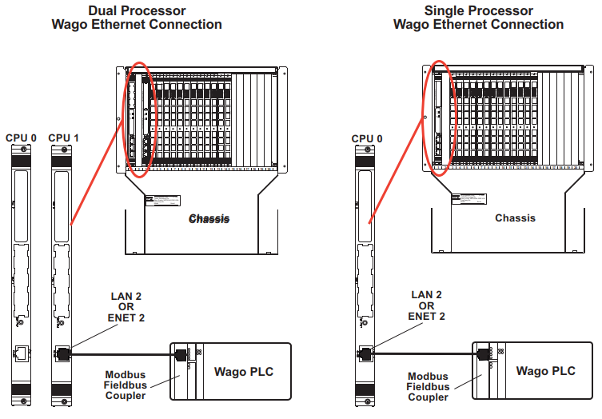

# VME板卡

## VME板卡概述

VME类型的板卡安装在494系列机箱前面板的卡槽里。VME类型的板卡包括处理器板卡和494.40 型I/O母版

### 处理器板

一台主机至少需要一块VME处理器板。处理器板用于进行PIDF运算，并提供控制器与电脑工作站之间的接口

### I/O母版

每块I/O母版最多可以安装4块子板。自办可以用于调理传感器，驱动伺服阀，进行A/D和D/A输入输出。

 ### 多控制器

如果系统中需要使用多个控制器，需要使用494.43型多控制器接口卡。

 

### 系统更新速率

针对不同型号的控制器和通道数，下表列出了最大更新速率

 

| 通道数量            | FlexTest<BR>40 | FlexTest<BR>60 | FlexTest<BR>100 | FlexTest<BR>200 |
| ------------------- | -------------- | -------------- | --------------- | --------------- |
| **处理器类型**      | 2500           | **             | 5500            | 7100            |
| **1-2个控制通道**   | 6144 Hz        | 6144 Hz        | 6144 Hz         | NA              |
| **3-4个控制通道**   | 4096 Hz        | 4096 Hz        | 4096 Hz         | NA              |
| **5-8个控制通道**   | NA             | 2048 Hz        | 2048 Hz         | 6144 Hz         |
| **9-16个控制通道**  | NA             | NA             | 2048 Hz         | 4096 Hz         |
| **17-24个控制通道** | NA             | NA             | NA              | 2048 Hz         |
| **≥24个控制通道**   | NA             | NA             | NA              | 1024 Hz         |

 

### 如何安装或移除VME板卡

VME板卡通过板卡插槽进行连接，并利用顶部和底部的固定杆进行锁紧固定。

````
注意：

插入类板卡上包含一些静电敏感类元件，不正确的处理会导致板卡损坏。在安装或拆除板卡时，采用下列预防措施：
* 在安装或拆除板卡前，需要断开电源；
* 在接触板卡或主机前，通过防静电腕带将自己与机箱地短接；
* 将未使用的板卡放置于防静电包装袋中。在从非防静电状态下拆除板卡时，需要保证操作人员良好的接地；
* 在操作板卡时，通过接触前面板或板卡边缘进行，避免接触任何电路板原件，针脚或电路连接触点。
````

#### 板卡安装流程

1. 确保控制器软件配置正确，能够识别每一块板卡；
2. 在安装或移除板卡前，关闭主机箱电源；
3. 在触摸板卡前，通过防静电手环（MTS 00-183-454）将操作人员与主机箱地进行短接；
4. 设置494.40 I/O母版地址拨码开关，保证其地址与软件设置一致；
5. 安装VME板卡到主机箱上。
   1. 按下板卡上下两端的锁紧用卡扣(A)；
   2. 向两侧旋转锁紧用卡扣（B）；
   3. 小心的将板卡插入到VME卡槽中，直到不能继续插入为止（C）；
   4. 向内旋转锁紧用卡扣（D），直到板卡与背板连接装置紧密贴合；
   5. 安装固定螺丝（固定用卡扣上）(E)，保证其不会松动。

   


 #### 板卡移除流程

1.   在安装或移除板卡前，关闭主机箱电源；
2. 在触摸板卡前，通过防静电手环（MTS 00-183-454）将操作人员与主机箱地进行短接；
3. 从主机箱内，移除VME板卡：
   1. 松开板卡上下固定用卡扣上的固定螺丝(A)；
   2.  按下板卡上下两端的锁紧用卡扣(B)；
   3. 向两侧旋转锁紧用卡扣（C）；
   4. 从VME卡槽中将板卡移除（D）

   


## 处理器连接

### 连接电脑工作站

通过 10/100M 网线将安装在控制器VME卡槽上的494.96处理器板卡与工作站相连，工作站必须有一个专用的网卡接口

   


### 连接 Wago Ethernet TCP/IP现场总线耦合器

下图表明了控制器处理器与Wago PLC之间的连接方法

* 接线方法取决于控制器中处理器的数量和型号；
* Wago PLC通常通过安装在PLC上的Modebus 现场总线耦合器进行连接

   

 

 

## 494.40型I/O母板

### 简介

每块494.40型I/O母版最多可以安装4块子板。子板可以实现多种功能，如调理传感器，驱动伺服阀，进行A/D和D/A输入输出。

````
注意: 494.40B 是一种新一代的I/O母板，它与老板卡兼容
````

控制系统的HWI文件为控制软件提供了I/O母板和子板的地址映射关系。I/O母版的前面板上为每块子板提供了两个RJ-50接口。

 

#### 板卡特点

* I/O母板在前面板上为信号调理卡提供了旁路标定电阻插座

* 每一个板卡接头有一个软件控制的LED指示灯，该信号灯的空能可以通过控制器软件进行设置

* I/O母板内部为桥路补偿电阻提供了插座

* I/O母板提供了RJ-45服务接口

   


### 如何设置494.40型I/O母板

1. 在安装或移除板卡前，关闭主机箱电源；
2. 在触摸板卡前，通过防静电手环（MTS 00-183-454）将操作人员与主机箱地进行短接；
3. 设置新板卡：
   1. 设置板卡地址拨码开关；
   2. 安装所需要的子卡；
   3. （可选）在I/O母版上，安装桥路补偿电阻；
   4. （可选）在I/O母版前面板上安装旁路标定电阻；
4.  安装I/O母板：
   1. 将母板插入到主机箱VME卡槽中；
   2. 连接母版的线缆；
5. 在安装完所有的板卡后，对系统上电，用硬件映射软件(HWI)和控制器软禁进行地址和其它项的设置；
6. 系统至少预热1个小时；
7.  对系统进行标定和调参。

 

### Model 494.40 母板设置

当增加或替换 I/O母板时，需要设置母板的地址。如果使用DUC子卡，还可以在母板上安装旁路标定电阻和桥路补偿电阻。

   

 

#### 如何设置494.40母板的地址

I/O母板的地址必须与系统控制软件中映射的地址一致。

1.  确定 I/O 母板的地址；
2. 找到 SW1 和 SW2拨码开关，按照下图对地址进行设置

   

 

#### 如何在I/O母板上安装旁路标定电阻

494.40型I/O母板前面板上有一组旁路标定电阻插槽，用于安装DUC卡的旁路标定电阻。每个插槽均对应一个RJ50接口

1. 确认传感器所连接的RJ50接口；
2. 将旁路标定电阻焊接到旁路电阻插座总成上（MTS 1-433-826）；
3. 将旁路标定电阻插座总成安装到前面板插槽中去。

```
注意： 如果你是在使用MTS TEDS模块，或者内部集成有旁路标定电阻的传感器，需要将跳线帽(MTS 100-188-097)安装到对应的插槽中
```


   #### 如何安装桥路补偿电阻

在DUC卡调理1/4电桥时，可以在I/O母板上为DUC卡安装桥路补偿电阻。I/O卡上有8个补偿电阻插槽，每个插槽对应一个前面板的RJ-50接口。

1. 确定RJ-50接口所对应的调理卡；
2. 在与该接口对应的插槽，安装桥路补偿电阻；
3. 在DUC卡上，设置桥路补偿开关至1/4电桥位置。

   

 


