# 功能子卡

## 功能子卡简介

你可以将下表所列的任何一种型号的子卡安装到494.40 I/O母板的任一位置。

````
注意
    在主机电源关闭的情况下，如果子卡对应的任一端口输入高电平信号都将损坏子卡。
    在关机的情况下，严禁将高电平信号输入到子卡中。在关闭主机电源前，首先关闭所有的外部供电设备
````

### 连接

每一块子卡在前面板上对应有两个RJ-50接口，通过这个接口可以连接外部设备或过渡板

### 设置

可以通过板卡上的拨码开关、硬件映射软件和控制软件对子卡进行配置。在494.40母板上可以安装旁路标定和桥路补偿电阻。

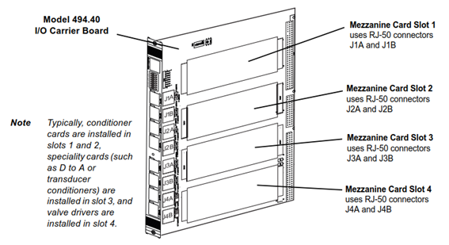


| 型号   | 子卡类型                       | 功能                                                         | 配套使用的转接卡                                             |
| ------ | ------------------------------ | ------------------------------------------------------------ | ------------------------------------------------------------ |
| 494.16 | 伺服阀驱动/单通道信号调理卡    | 该板卡包含一个通用型调理器（JXA）和一个伺服阀驱动器（JXB）;<BR>调理器部分与494.26型板卡相同;<BR>在控制二级阀时，可将JXA配置为控制反馈，JXB配置为二级阀驱动;<BR>在控制三级阀时，可将JXA配置为三级阀内部的LVDT反馈，JXB配置为伺服阀驱动。 | 不需要                                                       |
| 494.21 | 带加速度补偿的多量程信号调理卡 | 该板卡包含一个多量程的通用型调理器输入（DUC）和一个加速度传感器补偿输入。两个输入信号根据软件设置进行累加。<BR><BR>**注意**<BR>*此板卡也可作为独立的多量程通用处理器使用。* | 不需要                                                       |
| 494.25 | 单通道调理卡                   | 该板卡包含一个通用型调理器输入（DUC），可以配置陈AC调理器或DC调理器，该调理器只使用前面板上的一个RJ-50接头（JXA），JXB接口空闲，不使用。<BR><BR>AC配置主要用于对LVDT传感器进行调理。DC配置可适用于1/4，1/2或全桥类型的传感器。<BR><BR>该板卡的配置和设置方式与494.26型双DUC板卡相同 | 不需要                                                       |
| 494.26 | 双通道调理卡                   | 该板卡包含两个独立的通用型调理器输入（DUC），通过软件可以独立的配置为AC或DC调理器，每一个调理器专用一个IO母板上的RJ-50接口。<BR><BR>AC配置主要用于对LVDT传感器进行调理。DC配置可适用于1/4，1/2或全桥类型的传感器。 | 不需要                                                       |
| 494.45 | 8通道A/D输入卡                 | 该板卡可以将多达8个±10V的的模拟信号输入到控制器中。<BR><BR>输入信号可以直接与前面板RJ-50接口连接，也可以通过 494.75型BNC输入转接板进行连接。<BR><BR>输入信号 1-4 使用 JXA接口<BR>输入信号 5-8 使用 JXB接口 | 494.75   8通道BNC输入转接板                                  |
| 494.46 | 8通道D/A输出卡                 | 该板卡可以将多达8个±10V的的模拟信号输出到外设中。<BR><BR>输出信号可以直接与前面板RJ-50接口连接，也可以通过 494.76型BNC输出转接板进行连接。<BR><BR>可以通过系统配置，将模拟输出信号通过494.79型伺服阀驱动转接板，驱动8路252系列伺服阀.<BR>输出信号 1-4 使用 JXA接口<BR>输出信号 5-8 使用 JXB接口 | 494.76   8通道BNC输出转接板<BR><BR>494.79 8通道伺服阀驱动转接板 |
| 494.47 | 双UART/编码器接口卡            | 该板卡可以配置为两种工作模式，分别为**串口通讯模式**和**数字传感器模式**。<BR><BR>**串口通讯模式** -- 提供了两路串口接口，通过软件配置，可以支持RS-485（2线或4线）通讯，实现与 494.05型手柄或 409型温度控制器的通讯。<BR><BR>**数字传感器模式** -- 提供两个支持各种数字传感器协议的通讯接口，支持的通讯协议包括：增量编码器 ，Temposonic G传感器的脉宽调制输出，标准的异步串口协议。<BR><BR>**注意**<BR>但使用**数字传感器模式**时，两个接口需要使用同样的传感器协议。 | 不需要                                                       |


## 如何安装功能子卡

每一个494.40 I/O母卡均有四个卡槽用于安装子卡。

1. 在安装或移除板卡前，关闭主机箱电源；
2. 在触摸板卡前，通过防静电手环（MTS 00-183-454）将操作人员与主机箱地进行短接；
3. 安装子卡：
   1. 将I/O母卡平放在防静电桌面上。如果I/O母卡没有放平，可能造成子卡安装不正确；
   2. 将子卡接头与母板上的卡槽对齐。当正确对齐时，板卡可以轻微上下移动。
4. 用力将子卡插入插槽中
   1. 四个角均匀向下用力（B），使子卡两侧同时进入卡槽；
   2.  确认板卡两侧接头完全进入卡槽。

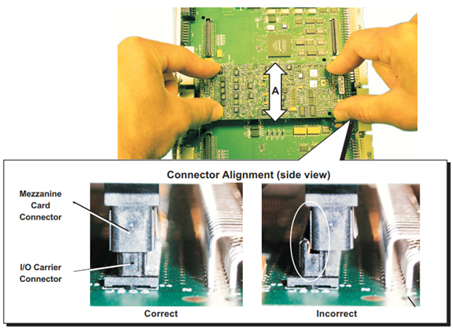


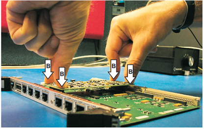


## 如何移除功能子卡

1. 在安装或移除板卡前，关闭主机箱电源；

2. 在触摸板卡前，通过防静电手环（MTS 00-183-454）将操作人员与主机箱地进行短接；

3. 移除子卡：

   1. 将I/O母卡平放在防静电桌面上。如果I/O母卡没有放平，可能造成子卡安装不正确；
   2. 抓住子卡的四个角，一边轻轻晃动，一边向上提起。不要从子卡的边缘撬。

   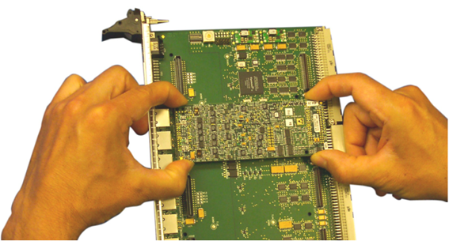


# 数字通用调理卡

## 数字通用调理卡简介

一些494系列的子卡包含有通用数字调理电路（DUC），为AC和DC传感器提供调理功能。所有的DUC电路均具有同样的特性和规格，通过软禁可以配置为AC或DC调理器。

下列子卡包含有通用型数字调理器：

* 494.26型双DUC子卡；
* 494.25型单DUC子卡；
* 494.16型伺服阀驱动/DUC子卡；
* 494.21型多量程，带加速度补偿子卡


````
注意：
如果操作不正常，会导致DUC板卡的部分零件损坏。

但机柜电源关闭时，如果输入一个高电压信号会导致DUC板卡的损坏。因此，需要在关闭控制器电源前，关闭外设的电源。
````


##  数字通用调理卡特性

数字通用调理卡既可以配置为AC调理器，也可配置为DC调理器。

### 概述

* 增益软件可调，适用于各种传感器；
* 每一个DUC通道具有自己的LED指示灯（位于母板上）；
* 调理器具有 IEEE 1451.4 Class 2 智能传感器接口；
* 高频输入滤波器，保护板卡免受ESD和EMI干扰；
* 在AD转换器前有模拟抗混叠滤波器；
*  调理器内部继承有可编程的数字滤波器。


### 激励

* 在直流激励模式下，激励电压感应电路通过提高激励电压，补偿导线电压降；
* 具有激励电流（过大或国小）检测电路，当检测到激励错误时，会触发系统互锁；
* 交流调理模式下，支持多种激励频率（软件配置）。


### 直流配置

* 直流调理器支持1/4桥，半桥，全桥配置的传感器；
* 1/4桥传感器支持使用用户提供的桥路补偿电阻；
* 半桥传感器可以使用调理电路内置的桥路补偿电阻；
* 可以通过软件配置，选择旁路标定电阻并联的支路。


### 规格表

| 参数                      | 规格                                                         |
| ------------------------- | ------------------------------------------------------------ |
| **输入类型**              | AC 或 DC （软件配置）                                        |
| **调理器模拟增益**        | 模拟增益：x.91, x1.75, x3.25, x6.28, x11.36, <br>x21.92, x40.69, x78.60, x150.59, x290.64, x539.11, <br>x1042.08, x1815.24, x3503.41, x6498.55, x12379.91<br><br>模拟增益由软件进行配置 |
| **增益稳定性**            | DC增益稳定性： 30 ppm/℃ <br>AC增益稳定性： 55 ppm/℃          |
| **共模抑制（增益为120）** | ± 11V <br>100dB 直流 @  120Hz； 60dB@1KHz                    |
| **输入阻抗**              | AC: 1 MΩ<br>DC: 100 MΩ                                       |
| **直流激励**              | 1 ~ 20 VDC(由软件配置)<br>**注意：**如果将传感器配置为8线模式，同时采用4芯电缆，将会导致激励电压不正确。 |
| **A/D分辨率**             | 16位                                                         |
| **激励稳定性**            | AC: 30 ppm/℃(典型值）<br>DC: 25 ppm/℃(典型值）               |
| **AC激励**                | 激励电压： 0.5 V peak-to 10V peak（软件设置）<br><br>激励频率： 10 KHz， 5 KHz， 2.5 KHz， 2KHz， 1KHz（软件设置） |
| **激励驱动电流**          | 不超过 100 mA （AC/DC)                                       |
| **激励失效互锁**          | 过电流或欠电流会产生系统互锁<br><br>AC/DC过电流： 105 mA（典型）<br>AC/DC欠电流： 1~2 mA（典型）<br><br/>**注意：**<br>当传感器采用AC激励时，如果DC电阻＞180Ω，可能会造成欠电流检测不正常，始终报告欠电流状态。此时，需要从控制器软件中禁用此通道的激励失效互锁。<br><br>激励失效互锁适用于1/4-，1/2-和全桥电路，适用于AC或DC激励方式。 |
| **智能传感器接口**        | IEEE 1451.4 Class 2                                          |

### 桥路连接

全桥、半桥和1/4桥的配置如下图所示。


#### 旁路标定

旁路标定电阻安装在I/O母卡的前面板上，通过HWI软件可以指定其与电桥的哪个分支并联。


#### 全桥配置

全桥的配置如下图所示：

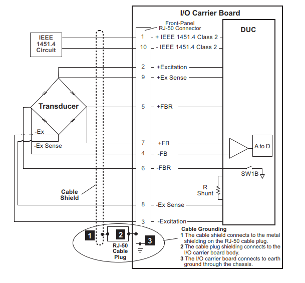


#### 半桥配置

半桥配置如下图所示。在半桥配置中，传感器构成了一半电桥的，另一半由DUC板卡内部提供。

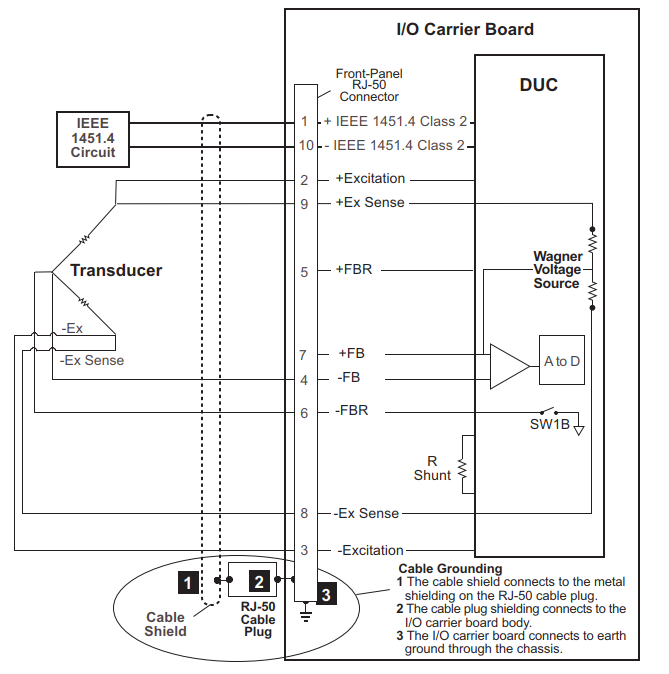


#### 1/4桥配置

1/4电桥配置如下图所示。

当使用1/4电桥配置时，需要在I/O板卡上安装电桥补偿电阻。当安装完后，设置开关SW1A使得电阻的一段与FBR相连。

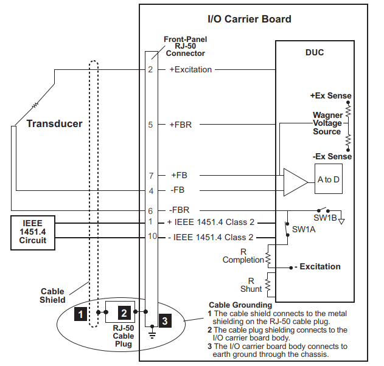


#### LVDT传感器配置

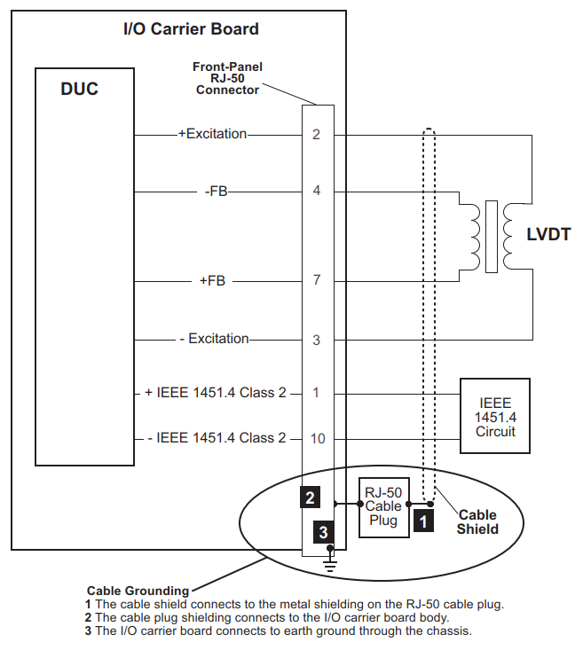


#### DUC板卡设置

1.  在安装或移除板卡前，关闭主机箱电源；
2. 在触摸板卡前，通过防静电手环（MTS 00-183-454）将操作人员与主机箱地进行短接；
3.  配置子卡：
   1. （可选）对于需要0电压参考的传感器，将板卡的接地开关拨到ON位置；
   2. （可选）对于1/4桥传感器，将桥路补偿开关拨到ON位置
   3. （可选）将旁路标定电阻插到前面板对应插座里
4. 将子卡安装到I/O母卡上；
5. 重复3，直到所有的子卡均安装到母卡上；
6. 安装I/O母卡：
   1. 母卡插入主机箱VME卡槽中；
   2. 连接母卡端口与传感器线缆。
7.   将主机上电，用HWI软件和控制器软件对每个调理器进行配置

````
注意：

如果采用4芯线缆连接，但配置为8芯线缆，将会导致激励电压不正确。
控制器预热1小时以上，然后进行标定和参数调整
````


## 494.25 型单通道调理卡

### 简介

494.25单通道数字型通用调理卡是一块适用于494.40型I/O母卡的子卡。该板卡包含有一个数字型通用调理器，可以配置为交流模式或直流模式。板卡与传感器通过位于母卡前面板上的RJ-50接口进行连接


### 板卡配置

#### 硬件配置

该板卡具有一个双位拨码开关用于设置DC调理器的功能：

* 开关A用于连接桥路补偿电阻到FBR，完成1/4桥路配置；
* 开关B用于连接地电平到FBR，为外部传感器提供参考零电平；

#### 软件配置

在硬件设置和安装完成后，需要通过控制软件对调理器进行配置。

````
注意：
控制软件配置、标定和调参细节参考软件tuning/calibration章节
````

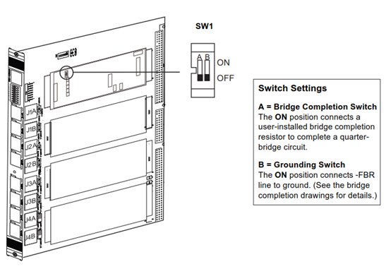


### 494.25板卡接口针脚定义

信号通过I/O接口前面板的RJ-50接头与调理器相连。

````
小心： 
前面板插槽只能使用10芯，带屏蔽的RJ-50接头线缆，如果使用其它型号的RJ接头，会导致板卡损坏。
````

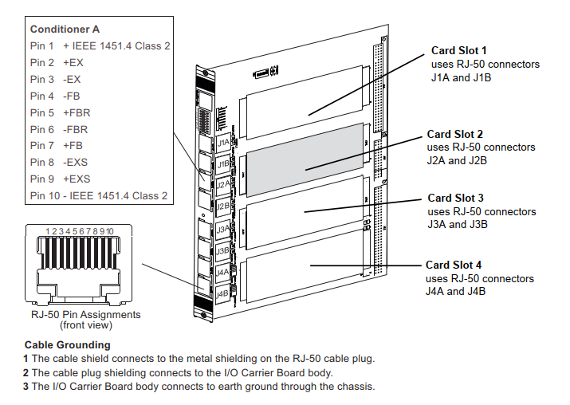


## 494.26 型双通道调理卡

### 简介

494.26双通道数字型通用调理卡是一块适用于494.40型I/O母卡的子卡。该板卡包含有两个数字型通用调理器，可以独立配置为交流模式或直流模式。板卡与传感器通过位于母卡前面板上的RJ-50接口进行连接


### 板卡配置

#### 硬件配置

两个调理器各有一个双位拨码开关用于设置DC调理器的功能：

- 开关A用于连接桥路补偿电阻到FBR，完成1/4桥路配置；
- 开关B用于连接地电平到FBR，为外部传感器提供参考零电平；

#### 软件配置

在硬件设置和安装完成后，需要通过控制软件对调理器进行配置。

```
注意：
控制软件配置、标定和调参细节参考软件tuning/calibration章节
```

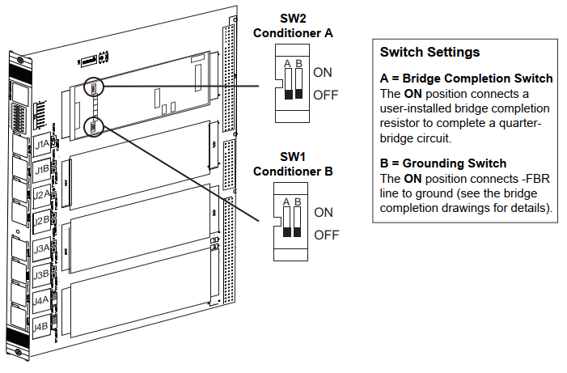


### 494.26板卡接口针脚定义

信号通过I/O接口前面板的RJ-50接头与调理器相连。

```
小心： 
前面板插槽只能使用10芯，带屏蔽的RJ-50接头线缆，如果使用其它型号的RJ接头，会导致板卡损坏。
```

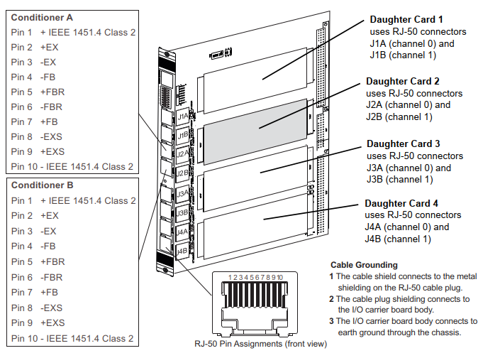


## 494.16 型伺服阀驱动/单通道信号调理卡

### 简介

494.16伺服阀驱动/通用型调理卡是一块适用于494.40型I/O母卡的子卡。该板卡包含一个伺服阀驱动器和一个数字型通用调理器，该卡可以安装于母卡的任意一个卡槽中。


#### 用于驱动2-Stage阀

该板卡可以驱动单个二级阀或双二级阀。在与二级阀配合使用时，既可以将DUC通道配置为控制反馈信号，也可以配置为外部输入信号。


#### 用于驱动3-Stage阀

该板卡可以驱动1个三级阀。在与二级阀配合使用时，可以将DUC保留给三级阀的LVDT使用。


### 494.16 型板卡特性

#### 伺服阀输出

伺服阀驱动器包含两个能够输出相同驱动信号的端口。既可以使用这两个输出端口，为每个阀线圈提供独立的电流源（单阀），也可以同时驱动双二级阀。

#### 伺服阀驱动特性

* 每个伺服阀驱动器均可配置满量程电流；
* 每个伺服阀输出均有可调整的震颤（dither）信号用于帮助克服静态摩擦和粘滞；
* 每个阀驱动器输出包含一个阀平衡控制信号。该信号是一个增加到伺服阀命令上的直流偏置用于补偿伺服阀的机械不平衡性

#### 伺服阀安全特性

伺服阀驱动电路能够在启动或掉电时，阻止阀的运动。

* 初始上电时，软件控制的开关将阀输出短接到地，直到台架可控；
* 在互锁条件下（如控制柜掉电），软件控制开关将阀驱动输出短路，保持阀的运动；
* 输出端有一组二极管，保护控制电路受到阀线圈电压跳动的冲击

### 规格表

| 参数                     | 规格                                                         |
| ------------------------ | ------------------------------------------------------------ |
| **输出电流**             | 每个输出端口不超过100 mA（软件配置）                         |
| **伺服阀输出数量**       | 2                                                            |
| **振颤**<br>频率<br>幅值 | <br>1 Hz ~ 4915.2 Hz (软件配置)<br>0 ~ 5 VDC (软件配置)      |
| **阀钳位**               | `通过软件配置伺服阀钳位，当液压互锁发生时，实现以下功能：<br><br/>* **Disabled** -- 伺服阀不进行钳位锁止（默认选项）<br/><br/>* **Zero** -- 钳位伺服阀到零位。如果使用阀平衡，将钳位到该值；<br/><br/>* **Positive** -- 钳位伺服阀到二级阀 正50%开度， 三级阀50%开度处；<br/><br/>* **Negative** -- 钳位伺服阀到二级阀 负50%开度， 三级阀50%开度处；<br |
| **阀平衡偏置**           | ± 10 VDC（软件配置）                                         |


### VD/ DUC板卡设置

1. 在安装或移除板卡前，关闭主机箱电源；
2. 在触摸板卡前，通过防静电手环（MTS 00-183-454）将操作人员与主机箱地进行短接；
3.  配置伺服阀驱动/通用型调理卡：
   1. （可选）对于需要地电压参考的传感器，将板卡的接地开关拨到ON位置；
   2. （可选）对于1/4桥传感器，将桥路补偿开关拨到ON位置，并安装桥路补偿电阻；
4. 将494.16 伺服阀驱动/通用型调理卡安装到I/O母卡上；
5. （可选）将旁路标定电阻插到前面板对应插座里；
6.  安装I/O母卡：
   1.  将母卡插入主机箱VME卡槽中；
   2. 连接母卡端口与传感器线缆；
   3. 连接母卡端口与伺服阀线缆；
7. 在所有板卡安装完成后，将主机上电，用HWI软件和控制器软件对调理器和伺服阀驱动器进行配置；
8. 控制器预热1小时以上，然后进行标定和参数调整。


### 494.16 VD/DUC板卡配置

#### 硬件配置

两个调理器各有一个双位拨码开关用于设置DC调理器的功能：

- 开关A用于连接桥路补偿电阻到FBR，完成1/4桥路配置；
- 开关B用于连接地电平到FBR，为外部传感器提供参考零电平；

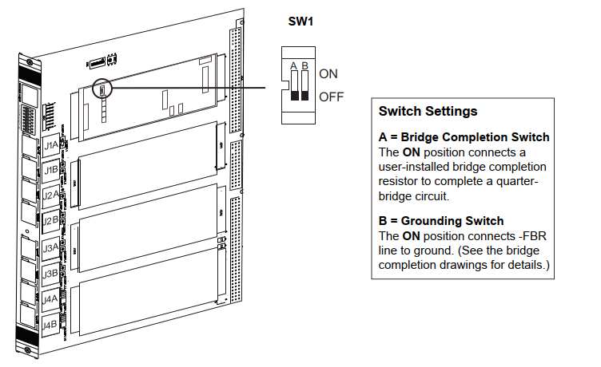

#### 软件配置

伺服阀控制器和数字通用调理器的多数配置均通过软件完成。


### 494.16板卡接口针脚定义

信号通过I/O接口前面板的RJ-50接头与调理器相连。

```
小心： 
前面板插槽只能使用10芯，带屏蔽的RJ-50接头线缆，如果使用其它型号的RJ接头，会导致板卡损坏。
```

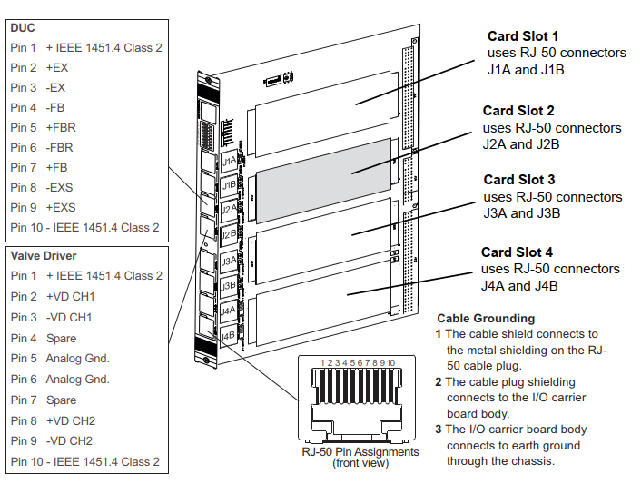


### 二级阀与 494.16 VD/DUC板卡的配合使用

当494.16 VD/DUC板卡与二级阀一起使用时，可以采用DUC作为控制反馈，VD作为伺服阀控制信号。


#### 单二级阀

两个伺服阀输出端口，每个端口驱动一个伺服阀线圈。


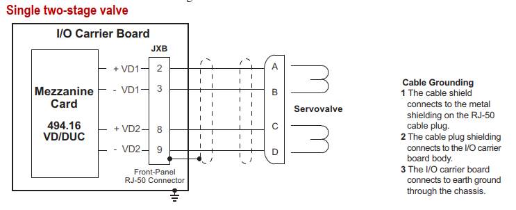


#### 双二级阀

两个伺服阀输出端口，每个端口以并联形式，同时驱动一个伺服阀的两个线圈。

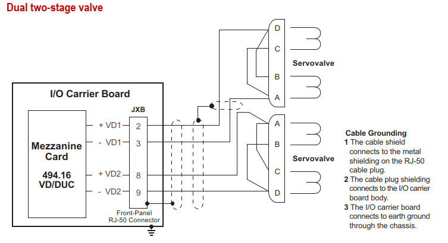


### 三级阀与 494.16 VD/DUC板卡的配合使用

当494.16 VD/DUC板卡与三级阀一起使用时，内循环中的LVDT使用DUC电路进行调理，VD电路驱动252型伺服阀（二级阀）实现对256或257型伺服阀（三级阀）的控制


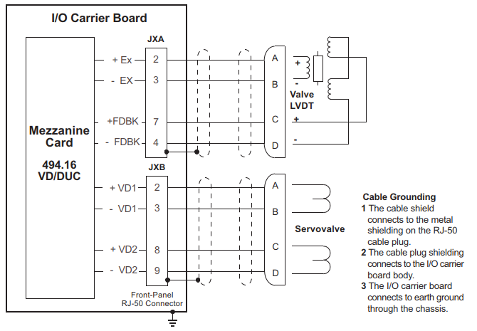


## 494.21 型带加速度补偿的多量程信号调理卡

### 简介

494.21占用一个494.40型I/O母卡的子卡槽。该板卡包含一个多量程的数字型通用调理器和一个加速度补偿输入。

加速度补偿信号与DUC输入信号累加去补偿由于传感器质量运动造成的误差。两个信号的的累加可以通过软件进行设置。

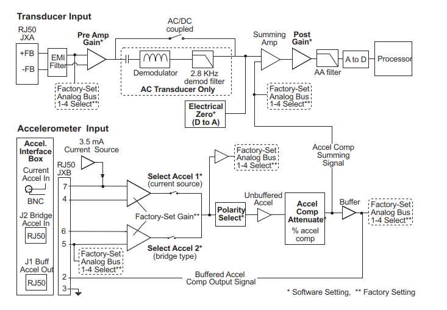


#### 传感器输入

该板卡包含一个多量程的信号调理器，既可以配置成直流调理器，又可以配置成交流调理器。传感器通过母板前面板上的RJ-50接口与调理器相连

该DUC电路与其它494系列板卡类似，但还包含一个额外的AC传感器解耦器（位于累加器前）。该结构其允许在交流传感器信号的技术上增加一个零偏电压。

#### 加速度传感器输入

通过软件制定加速度传感器的类型：

* **电桥设备** –- 提供一个电桥型加速度传感器

* **电流源** –- 提供一个3.5 mA 的电流源激励和一个差分放大器，与加速度计直连

* **带缓存的加速度输出** -– 接收外部设备的缓冲输出，如电荷放大器


#### 加速度传感器增益设置

桥路和电流源型加速度传感器的增益在出厂时已经进行过设定，以匹配特定的传感器.


#### 加速度适配盒

该模块提供494.21板卡与各种类型传感器之间的接口。

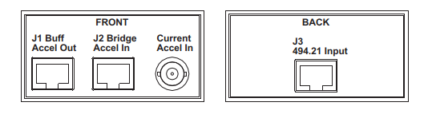


#### 电子调零

DUC电路允许通过软件设置对进入累加器前的传感器信号进行电子调零。能够帮助用户对偏置电压进行补偿，防止信号饱和。


### 规格表

| 参数                      | 规格                                                         |
| ------------------------- | ------------------------------------------------------------ |
| **输入类型**              | AC 或 DC （软件配置）                                        |
| **调理器模拟增益**        | 模拟增益：x.91, x1.75, x3.25, x6.28, x11.36, <br>x21.92, x40.69, x78.60, x150.59, x290.64, x539.11, <br>x1042.08, x1815.24, x3503.41, x6498.55, x12379.91<br><br>模拟增益由软件进行配置 |
| **增益稳定性**            | DC增益稳定性： 30 ppm/℃ <br>AC增益稳定性： 55 ppm/℃          |
| **共模抑制（增益为120）** | ± 11V <br>100dB 直流 @  120Hz； 60dB@1KHz                    |
| **输入阻抗**              | AC: 1 MΩ<br>DC: 100 MΩ                                       |
| **直流激励**              | 1 ~ 20 VDC(由软件配置)<br>**注意：**如果将传感器配置为8线模式，同时采用4芯电缆，将会导致激励电压不正确。 |
| **A/D分辨率**             | 16位                                                         |
| **激励稳定性**            | AC: 30 ppm/℃(典型值）<br>DC: 25 ppm/℃(典型值）               |
| **AC激励**                | 激励电压： 0.5 V peak-to 10V peak（软件设置）<br><br>激励频率： 10 KHz， 5 KHz， 2.5 KHz， 2KHz， 1KHz（软件设置） |
| **激励驱动电流**          | 不超过 100 mA （AC/DC)                                       |
| **激励失效互锁**          | 过电流或欠电流会产生系统互锁<br><br>AC/DC过电流： 105 mA（典型）<br>AC/DC欠电流： 1~2 mA（典型）<br><br/>**注意：**<br>当传感器采用AC激励时，如果DC电阻＞180Ω，可能会造成欠电流检测不正常，始终报告欠电流状态。此时，需要从控制器软件中禁用此通道的激励失效互锁。<br><br>激励失效互锁适用于1/4-，1/2-和全桥电路，适用于AC或DC激励方式。 |
| **智能传感器接口**        | IEEE 1451.4 Class 2                                          |


### 494.21 型多量程 DUC/加速度补偿板卡设置

#### 软件设置

伺服阀控制器和数字通用调理器的多数配置均通过软件完成。


#### 硬件设置

调理器有一个双位拨码开关SW1用于设置DC调理器的功能：

* 开关A用于连接桥路补偿电阻到FBR，完成1/4桥路配置

* 开关B用于连接地电平到FBR，为外部传感器提供参考零电平

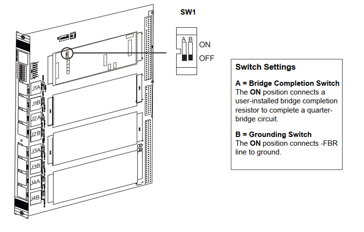


###  494.21板卡接口针脚定义

信号通过I/O接口前面板的RJ-50接头与调理器相连。

```
小心： 
前面板插槽只能使用10芯，带屏蔽的RJ-50接头线缆，如果使用其它型号的RJ接头，会导致板卡损坏。
```

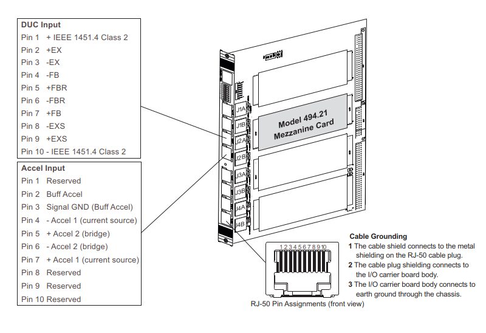

### 494.21板卡配置

下图为对力传感器进行加速度补偿的基础配置。

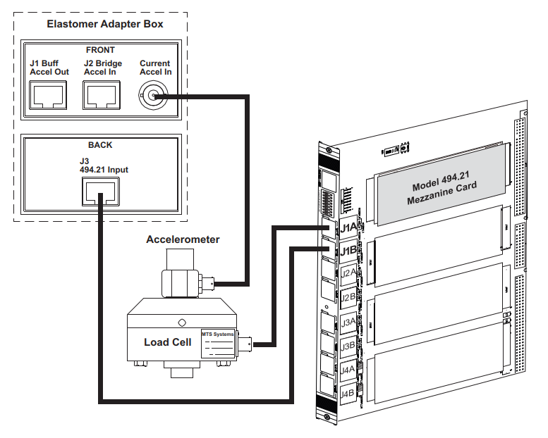


## 494.45型8通道A/D输入卡

### 494.45 型8通道A/D输入卡简介

494.45 8通道模拟信号输入调理卡占用494.40中的一个子板卡槽每个A/D卡最多可以接收8路模拟信号，每路输入各包含一个软件可调的数字滤波器

外部模拟信号通过494.75型转接卡后，然后通过面板接口再输出到AD卡上。

### 494.45 型8通道A/D输入卡规格

| 参数         | 规格                                      |
| ------------ | ----------------------------------------- |
| **输出**     | 每个494.45 A/D卡提供8个单端，模拟输出通道 |
| **分辨率**   | 16位                                      |
| **输出驱动** | ± 10 VDC @ 5 mA                           |


### 494.45 型8通道A/D输入卡引脚

信号通过I/O接口前面板的RJ-50接头与调理器相连。

```
小心： 
前面板插槽只能使用10芯，带屏蔽的RJ-50接头线缆，如果使用其它型号的RJ接头，会导致板卡损坏。
```

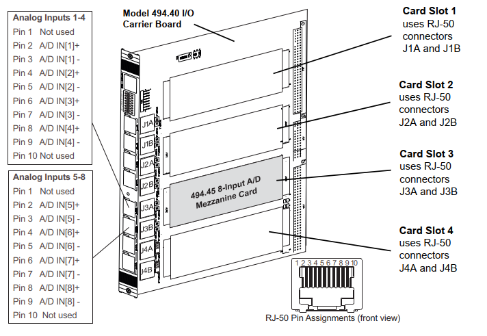


### 494.45 型8通道A/D输入卡连接

输入的模拟信号通过494.75型8通道转接卡后，再进入到AD卡上。转接卡的两个输出（J11, J12）与I/O母板上AD卡所对应的两个RJ-50接口相连（J3A和J3B）

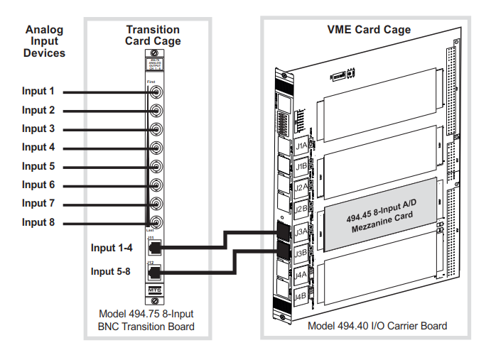


## 494.46型8通道D/A输出卡

### 494.46 型8通道A/D输出卡简介

494.46 8通道模拟信号输出调理卡占用494.40中的一个子板卡槽，每个A/D卡最多可以输出8路模拟信号，每路输出各包含一个软件可调的数字滤波器

输出信号通过经过494.76 8通道输出转接卡，输出转接卡通过DA卡对应的两个RJ-50接口与DA卡相连。

### 494.46 型8通道A/D输出卡规格

| 参数         | 规格                                      |
| ------------ | ----------------------------------------- |
| **输出**     | 每个494.46 D/A卡提供8个单端，模拟输出通道 |
| **分辨率**   | 16位                                      |
| **输出驱动** | ± 10 VDC @ 5 mA                           |


### 494.46 型8通道D/A输出卡引脚

信号通过I/O接口前面板的RJ-50接头与调理器相连。

```
小心： 
前面板插槽只能使用10芯，带屏蔽的RJ-50接头线缆，如果使用其它型号的RJ接头，会导致板卡损坏。
```

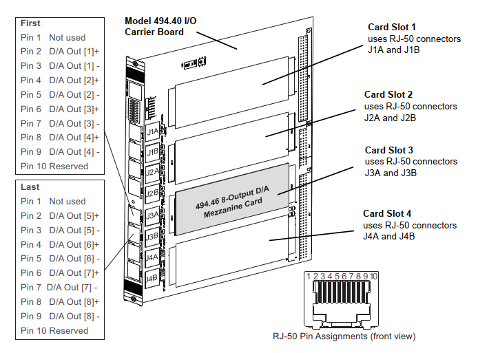


### 494.46 型8通道D/A输出卡连接

输出信号通过经过494.76 8通道输出转接卡，输出转接卡通过DA卡对应的两个RJ-50接口与DA卡相连。

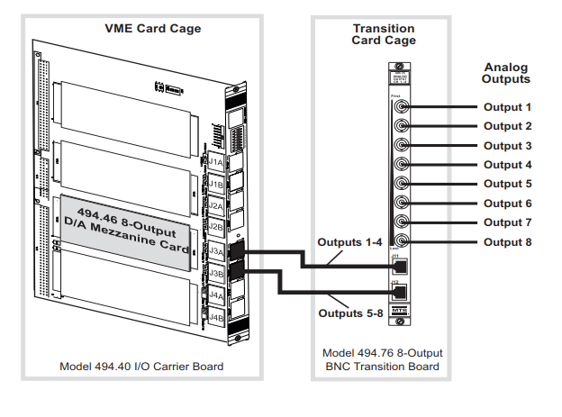


#### 伺服阀驱动

从494.46产生的模拟量输出可以用来驱动494.79 8通道伺服阀转接卡。

转接卡（J11,J12）通过前面板DA卡对应的两个RJ-50接口（J2A, J2B）与DA卡相连


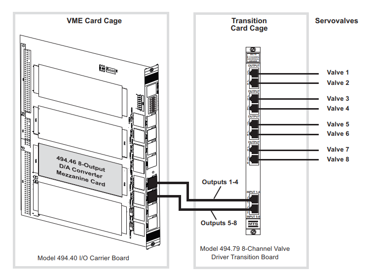


## 494.47型双UART/编码器接口卡

### 494.47型 UART/编码器接口卡简介

494.47型 UART/编码器接口卡占用494.40中的一个子板卡槽，每个494.47接口卡有两个接口，可以配置成两个UART设备，或两个数字传感器。通过软件可以对工作模式和其它参数进行设置。

软件中，可以设置板卡的外接设备类型（UART或数字传感器），如果选择数字传感器设备，必须同时选择工作模式（通讯协议），这些设置决定了板卡的功能和引脚定义。


#### UART配置

当配置为UART功能时，每个通道可以支持不同的设备。UART支持494.05 遥控手柄和 409温度控制器等设备。


#### 数字传感器设置

当配置为数字传感器功能是，两个传感器必须时同一类型的传感器。支持的传感器类型为：

* 具有正交输出的增量编码器；
* SSI设备，如Temposonics R传感器；
* Gurley绝对编码器；
* Temposonics G传感器；
* 计数器


#### 外部时钟输出

通过对494.47型接口卡进行配置，可以为外设提供差分形式的RS-485时钟和触发输出，使外设（如数采设备）与控制器时钟同步。


### 规格表

| 参数                            | 规格                                                         |
| ------------------------------- | ------------------------------------------------------------ |
| **编码器接口**                  | RS-485                                                       |
| **UART电子接口**                | RS-485（2 或 4 线）                                          |
| **UART波特率**                  | 300 到 57600 Baud（软件配置）                                |
| **电源输出**（到外设）          | 15 VDC，200 mA（持续电流）和400 mA（瞬时电流）保险           |
| **支持的编码器/数字传感器接口** | 可以通过硬件映射（HWI）软件选择所支持的接口类型：<br>* SSI (Temposonics R)<br/>* Gurley (Teledyne)<br/>* 增量/速度（包含计数器）<br/>* PWM（Temposonics G) |


#### SSI 占空比设定

老版本的494.47和494.49板卡对SSI时钟使用25%低/75%高的占空比设定。为了支持其它类型的SSI编码器，新版本的板卡根据SSI波特率进行占空比设定：

* SSI 波特率 ≤ 115.74 kHz = 50/50占空比

* SSI 波特率 ＞ 115.74 kHz = 25/75占空比

  

  ### UART 引脚

信号通过I/O接口前面板的RJ-50接头与调理器相连。板卡的功能决定了引脚功能，下图为将板卡配置为RS-485/UART设备时的引脚功能


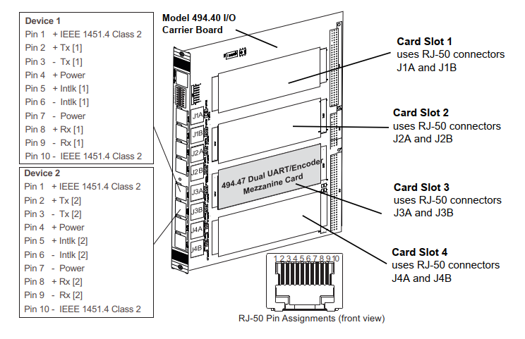


### 494.47 型双UART/Encoder板卡的连接

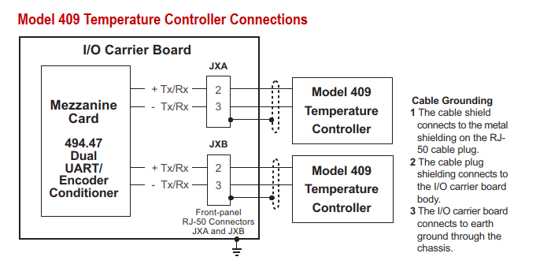


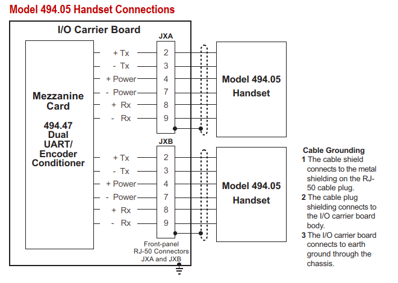


### 增量式编码器/计数器引脚

信号通过I/O接口前面板的RJ-50接头与调理器相连。板卡的功能决定了引脚功能，下图为将板卡配置为增量式编码器时的引脚功能

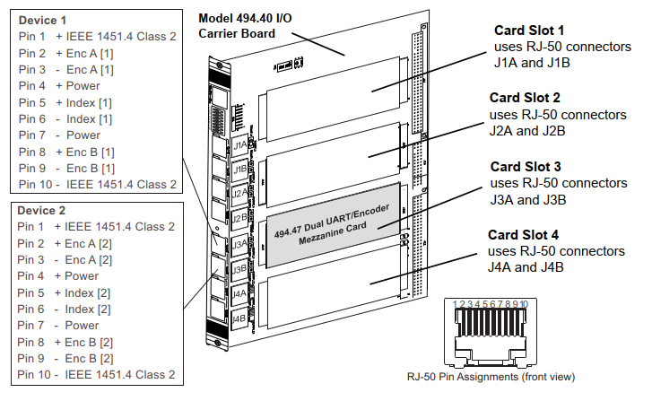


### 增量式编码器连接

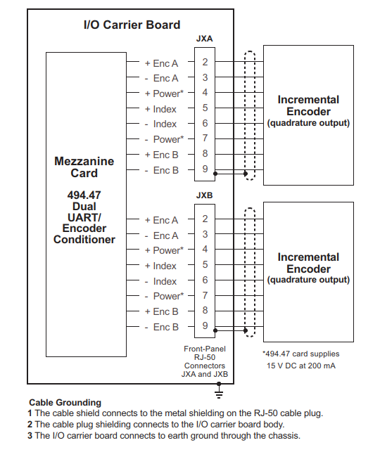


### 计数器连接

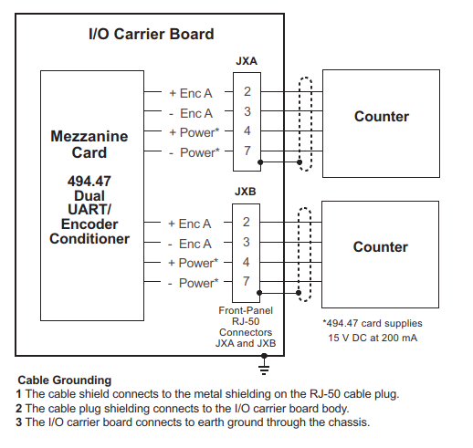


### SSI编码器引脚

 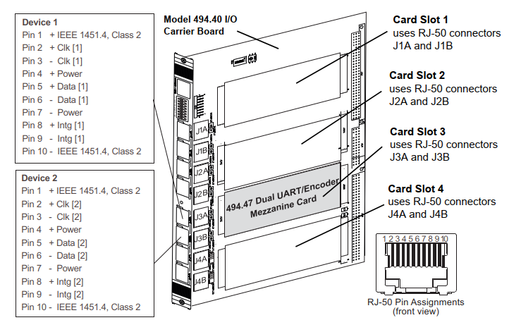


### SSI编码器连接

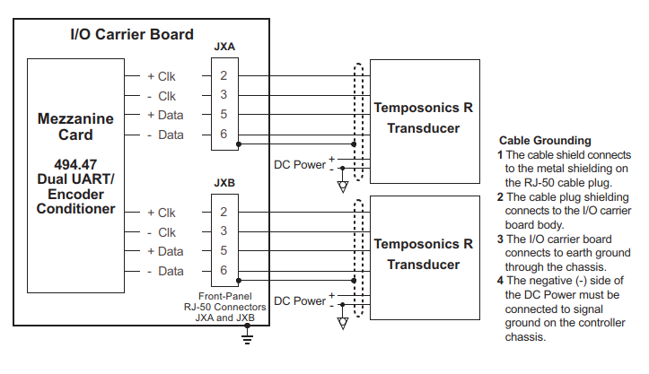


### 脉宽调理输出设备引脚

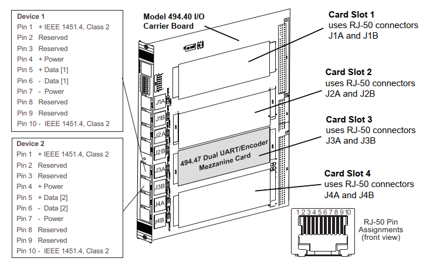


### 脉宽调理输出设备连接

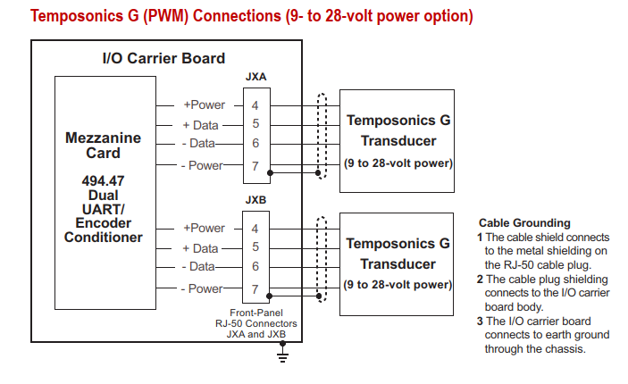


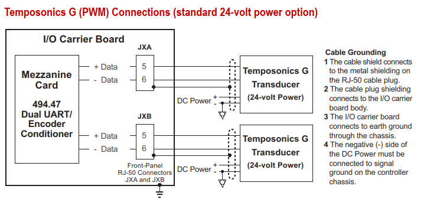


### 外部时钟连接

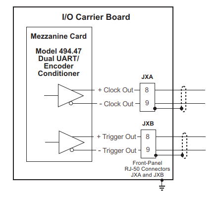


## 494.49 四通道编码器接口卡

### 简介

494.49型四通道编码器接口卡占用一个 494.40 IO母卡的位置，可以同时接受四路数字传感器（编码器）型号，一般需要配合494.80 型四通道编码器转接卡使用。

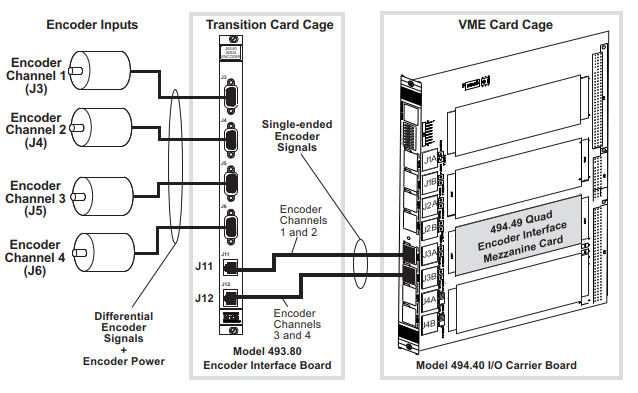


### 支持的传感器

494.49型四通道编码器接口卡支持以下类型的传感器：

* 增量编码器；
* SSI设备（Temposonics  R）；
* Gurley（Teledyne）；
* PWM设备（Temposonics  G）；


### 外部时钟输出

通过软件配置，494.49可以为外设提供TTL电平的时钟和触发信号，帮助外设（如数采设备）与控制器时钟同步。


### 参数表

| 参数                                      | 规格                                                         |
| ----------------------------------------- | ------------------------------------------------------------ |
| **数字传感器/<br>编码器接口**             | TTL 收发器<br/><br/>494.80四通道编码器转接卡将四路（J3-J8）RS-422编码信号转换为TTL编码器信号（J11，J12）与494.49四通道编码器接口卡匹配。 |
| **支持的<br/>数字传感器/<br/>编码器接口** | 使用硬件映射软件（HWI）选择以下类型的接口：<br/>* 增量编码器；<br/>* SSI设备（Temposonics  R）；<br/>* Gurley（Teledyne）；<br/>* PWM设备（Temposonics  G）； |
| **设备供电**                              | 494.49板卡不为外设供电，外设供电由493.80转接卡或外部电源提供 |


#### SSI 占空比设定

老版本的494.47和494.49板卡对SSI时钟使用25%低/75%高的占空比设定。为了支持其它类型的SSI编码器，新版本的板卡根据SSI波特率进行占空比设定：

- SSI 波特率 ≤ 115.74 kHz = 50/50占空比
- SSI 波特率 ＞ 115.74 kHz = 25/75占空比


### 494.49 四通道编码器接口卡连接

编码器信号通过493.80四通道编码器转接卡，对电压标准进行匹配后再与494.49 四通道编码器接口卡连接。转接卡的J11和J12接口与I/O接口前面板的RJ-50接头相连。

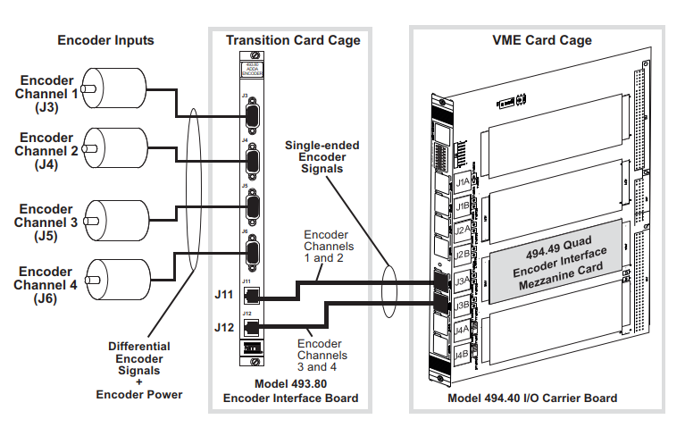


### 494.49 四通道编码器接口卡引脚

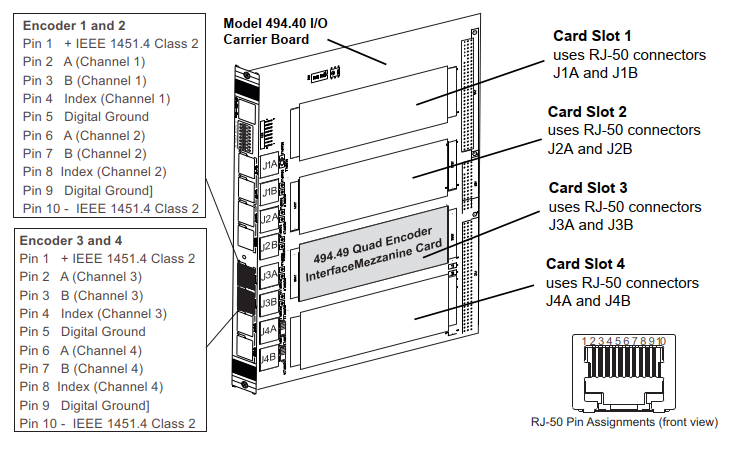


### 增量式编码器连接

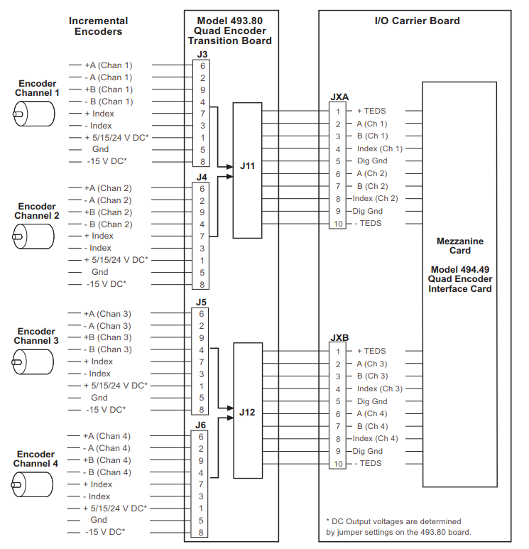


### 计数器连接

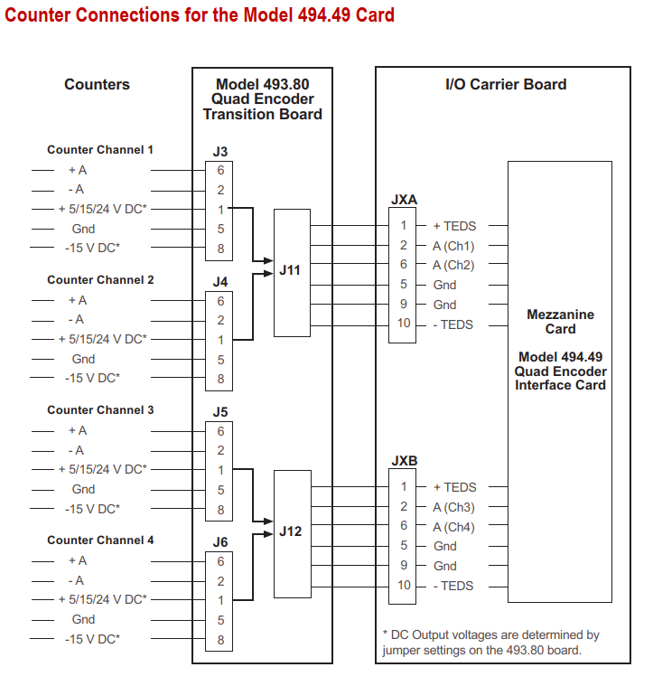


### SSI/Gurley 编码器引脚

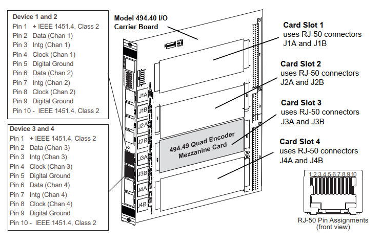


### SSI/Gurley（Temposonics R） 编码器连接

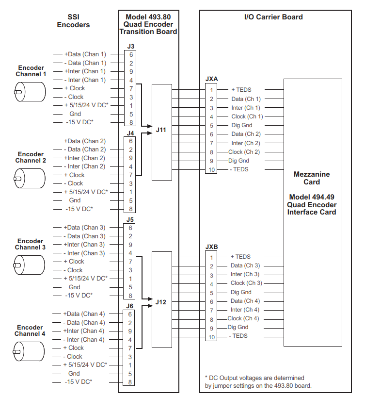


### PWM 引脚

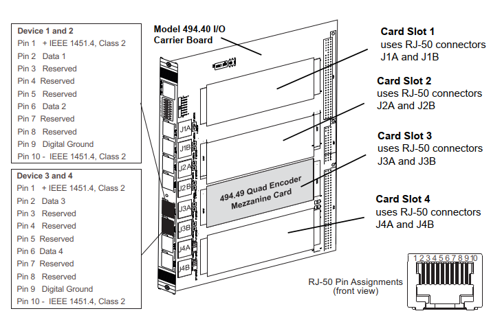


### PWM（Temposonics G）传感器连接

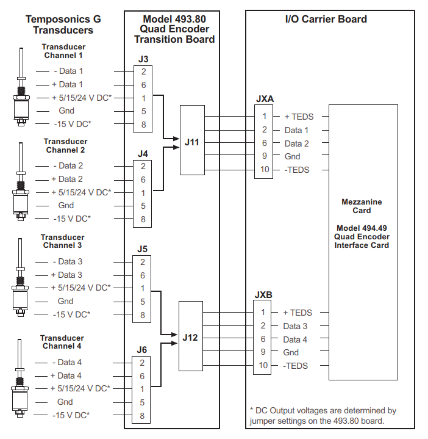


### 外部时钟输出连接

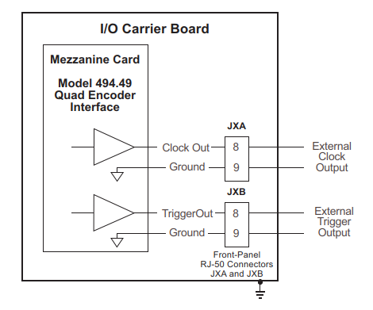


## TEDS传感器ID模块

### 简介

TEDS传感器ID模块包含一个存储有传感器ID的芯片和一个旁路标定电阻（可选），


### 传感器连接

TEDS模块可以选择不同的连接器，以便连接不同的传感器， TEDS模块同各国 572414-xx线缆连接到DUC功能卡上，该线缆一端为RJ-50接头与494.10IO卡连接，另一端为JT接头与TEDS模块连接。

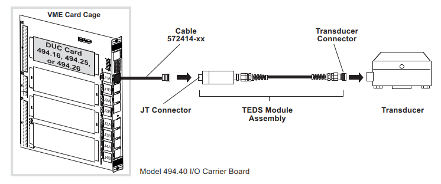


### 集成的旁路标定电阻

可以定制内部集成旁路标定电阻的TEDS模块。在使用内置旁路标定电阻时需要在494.10 IO板卡的旁路标定电阻插槽内安装跳针（MTS 100-188-097）.

### 外部旁路标定电阻

如果需要使用外部旁路标定电阻，需要购买内部集成短接跳线的TEDS模块。然后安装旁路标定电阻到插座里，然后安装到对应的旁路标定电阻插槽内。

.


