# 数字IO和转接卡

## 数字IO

### 简介

通过数字IO硬件，控制器可以驱动输出设备或监控输入设备，下列数字IO硬件与MTS FlexTest 40/60/200控制器兼容。

| 转接板                             | 功能                                                         |
| ---------------------------------- | ------------------------------------------------------------ |
| **493.72型数字IO卡**               | 提供16路数字输入和16路数字输出<br><br>493.72型数字IO卡通常与493.31型16通道低电流DI/O分线盒或493.31型16通道高电流DI/O分线盒配合使用 |
| **493.31型16通道低电流DI/O分线盒** | 为外设的数字输入和输出提供端子连接器，连接到493.72型数字IO卡上 |
| **493.31型16通道高电流DI/O分线盒** | 为外设的数字输入和输出提供端子连接器，并为外设提供电源       |
| **493.32型8通道DI/O分线盒**        | 提供8路带光耦隔离器的接口，用于连接大电流设备到494.44系统板上 |
| **493.33型数字IO电源**             | 为下列设备提供 24 VDC电源<br/>* 494.31 16通道大电流分线盒；<br/>* 494.32 8通道大电流分线盒 |

### 493.72型数字IO卡

#### 简介

49.72接口板是一种能够提供16个数字输入和16个数字输出的转接板，它通常与493..31（高电流）或493.31（低电流）分线盒组合使用。

 通过线缆将493.72的数字输入口（J3）和数字输出口（J4）连接到数字DIO分线盒上.

**数字输入口（J3）** - 能够用于在控制器软件中触发测试中的事件。通过控制器软件能够监控数字输入信号。493.72板卡包含一个可以配置的防振颤电路。

**数字输入端口（J4）** - 能够用于控制外部设备。数字输出信号通过控制器软件生成。这些低电流信号用于驱动与数字输出分线盒接口相连的输出设备。


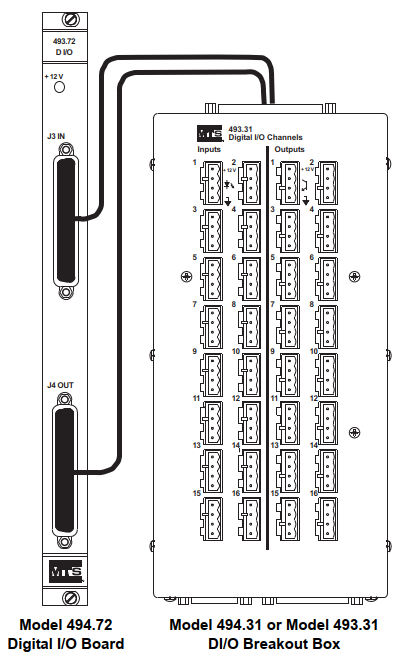

#### 规格表

| 参数                                 | 规格                                                         |
| ------------------------------------ | ------------------------------------------------------------ |
| **数字输入**<BR><BR><BR><BR><BR><BR> | **J3接头（D-37S）**<BR>提供16通道的带光耦隔离的数字输入：<BR>输入ON电压 = 2.7 ~ 26 VDC @ ＞0.5 mA电流<BR>输入OFF电压 ≤ 0.8 VDC<BR>输入电阻 = 2 kΩ<BR>通过跳线选择防震颤时间：<BR>2 ms， 10 ms， 1 ms， 0.1 ms |
| **数字输出**                         | **J4接头（D-37S）**<BR>提供16通道的带光耦隔离的数字输出：<BR>输出电压 = 5 ~ 30 VDC<BR>输出电流  ≤ 20 mA @ 12 VDC |

##### 低电流

低电流应用使用 493.31 DI/O分线盒， 使用493.72转接卡提供的12 VDC电源进行供电

##### 高电流

高电流应用使用493.31 DIO分线盒，使用493.72驱动分线盒中的高电流开关电路


#### 如何改变防震颤设置

如果有需要，可以通过调整493.72数字IO板卡的跳线帽来改变防振颤时间，每个跳线控制4个数字输入端口。

````
注意：默认未安装跳线帽，提供20ms的防震颤延时
````

1. 在493.72数字IO板上找到四组跳线座（X2-X5），每个跳线座能够设置一组（4个）数字输入的防振颤延时;
2.   安装跳线帽改变防振颤延时

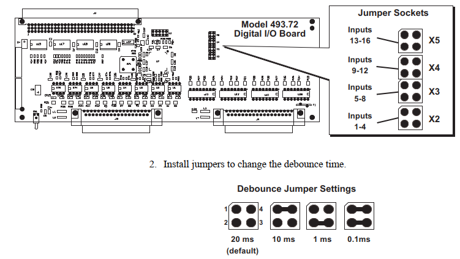

### 493.31型16通道低电流DI/O分线盒

#### 简介

493.31 16通道低电流DIO分线盒为外设提供了连接端子，分线盒通过两条线缆与DIO接口卡进行连接，一条用于数字输入，另一条用于数字输出。

##### 供电能力

493.31分线盒只提供接线端子,控制器通过493.72 DIO接口卡直接驱动外设

#### 连接

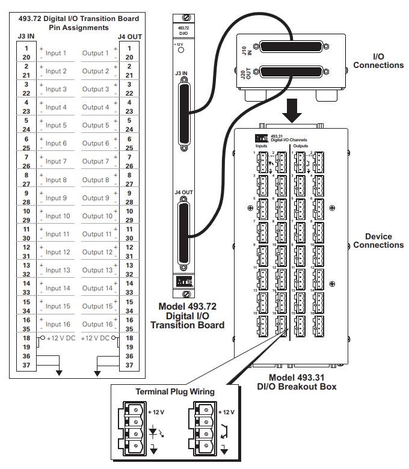

##### 逻辑输入连接

493.72板卡的**J3 In**端口最多可以从493.31分线盒中同时接收16路数字信号，这些信号直接被控制器软件获取。

###### 外设与分线盒之间的连接

每个输入外设连接到一组接线端子上，接线端子连接到其中一个基座上

###### 分线盒与493.72板卡之间的连接

通过一条电缆，连接分线盒的J10端子和493.72板卡的J3端子，DIO板卡为每个DIO接口提供了一个光耦隔离器

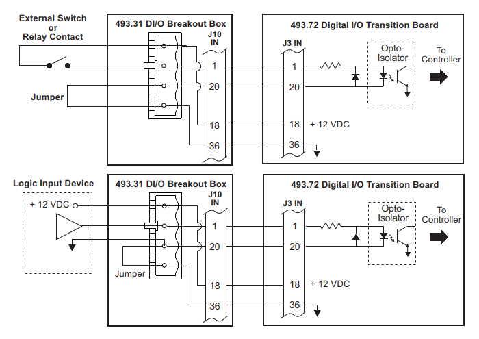


##### 逻辑输出连接

493.72板卡的**J4 Out**端口最多可以从493.31分线盒中同时输出16路数字信号，这些信号直接收到控制器软件控制

 ###### 外设与分线盒之间的连接

**设备连接** - 每个输出设备连接到一组接线端子上，接线端子安装到其中一个基座上

**电源连接** – 可以通过J21端口连接外部电源，该电源被分配到DIO分线盒的16个输出底座上

###### 分线盒与493.72板卡之间的连接

通过一条电缆，连接分线盒的J20端子和493.72板卡的J4端子，DIO板卡为每个DIO接口提供了一个光耦隔离器

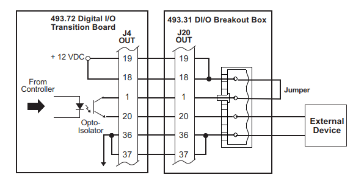


### 493.31型16通道高电流DI/O分线盒

#### 简介

493.72板卡的J4 Out端口最多可以从493.31分线盒中同时输出16路数字信号，这些信号直接收到控制器软件控制。分线盒通过2条电缆与493.72数字IO板卡相连，一条用于数字输入，一条用于数字输出

 

**外设连接** – 每一个输入/输出设备连接到端子插座上，然后插到分线盒基座上

**电源连接** – 可以连接外部输入/输出电源到 494.31 DIO分线盒上，通过各个接线座分配到各IO端口上

**高电流，电源开关电路** – 每一个数字输出包含一个受到光耦控制的功率MOSFET场效应管，


#### 规格表

| 参数                                               | 规格                                                         |
| -------------------------------------------------- | ------------------------------------------------------------ |
| **494.31型分线盒<br>输出电路**<br><br><br><br><br> | 大电流分线盒包含16个功率场效应管（每个输出通道一个），为外设提供大电流。<br><br>493.72板卡中的低电流光耦驱动分线盒中的大电流功率管<br><br>最大输出电压 = 30 VDC<br><br>最大输出电流 = 2A |


#### 连接

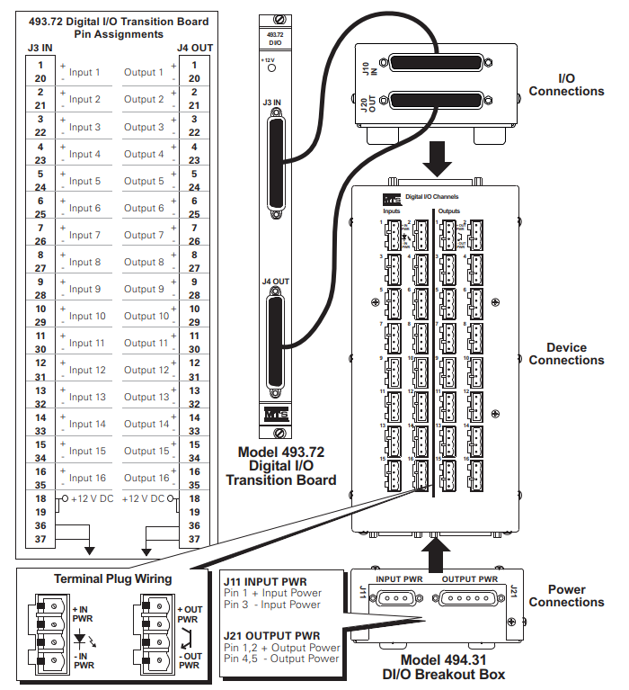


### 493.31型DI/O分线盒逻辑输入连接

493.72板卡的J3 In端口最多可以从493.31分线盒中同时接收16路数字信号，这些信号直接被控制器软件获取

###### 外设与分线盒之间的连接

设备 - 每个输入设备连接到一组接线端子上，接线端子连接到其中一个基座上

供电 – 如果需要，可以连接外部电源到J11，电源通过基座和接线端子，连接到各个DIO口

###### 分线盒与493.72板卡之间的连接

通过一条电缆，连接分线盒的J10端子和493.72板卡的J3端子，DIO板卡为每个DIO接口提供了一个光耦隔离器

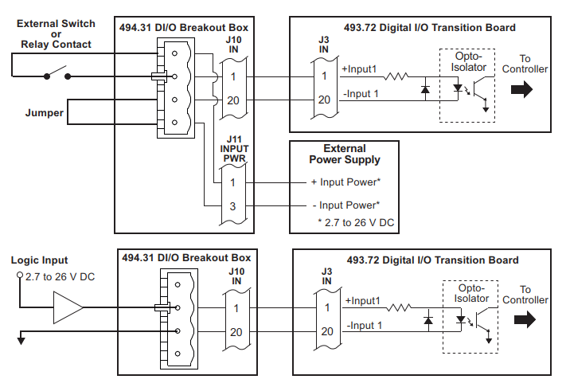


##### 逻辑输出连接

J4 Out端口最多可以同时输出16路数字信号，这些信号直可以用来控制外设。通过控制器软件可以控制这些数字信号输出

###### 外设与分线盒之间的连接

设备连接 - 每个输出设备连接到一组接线端子上，接线端子安装到其中一个基座上

电源连接 – 可以通过J21端口连接外部电源，该电源被分配到DIO分线盒的16个输出底座上

大电流，电源切换电路 – 每一个数字输出回路均包含一个受到光耦隔离控制的MOSFET功率场效应管，每个光电三极管最大可以经过30V DC 2A的电流

###### 分线盒与493.72板卡之间的连接

通过一条电缆，连接分线盒的J20端子和493.72板卡的J4端子，DIO板卡为每个DIO接口提供了一个光耦隔离器

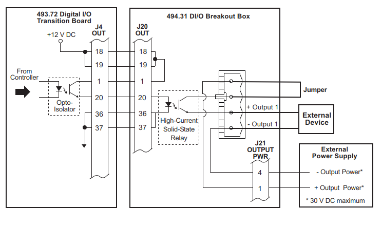


### 493.33型数字IO电源


## 转接卡

### 简介

转接卡（Transition Boards）安装在控制机主机箱后侧的转接卡卡槽内。通过转接卡，可以提供外设与控制器的接口。

| 转接卡                       | 功能                                                         |
| ---------------------------- | ------------------------------------------------------------ |
| Model 493.72 数字IO转接卡    | 提供16路通用数字输入通道和16路通用数字输出通道               |
| Model 493.73 HPU 接口卡      | 提供控制器与液压泵站直接的接口                               |
| Model 494.74 双站台HSM接口卡 | 提供控制器与分油器之间的接口，占用一个卡槽，最多提供两个站台的 off/low/high或比例控制。 |
| Model 493.74 双站台HSM接口卡 | 提供控制器与分油器之间的接口，占用两个卡槽，最多提供两个站台的 off/low/high或比例控制。 |
| Model 494.75 BNC输入转接卡   | 提供8个BNC接头的模拟量输入，通过RJ-50接口输入到494.45 A/D转换功能卡中 |
| Model 494.76 BNC输出转接卡   | 提供8个BNC接头的模拟量输出，通过RJ-50接口输入到494.46 D/A转换功能卡中 |
| Model 494.79 伺服阀驱动卡    | 包含8路独立的伺服阀驱动器，每个伺服阀驱动器需要一路的伺服阀驱动型号，驱动型号由494.46 8通道模拟量输出卡提供 |


### 493.73 HPU接口板

#### 简介

494.73型HPU接口卡占用一个卡槽位，安装在494主机箱背面的转接卡卡槽内。该板卡提供24V逻辑信号，控制液压泵站

````
注意：油泵急停输入和输出也是控制器急停系统的一部分
````


##### 特性

**服务指示LED** – 在系统系统时，服务指示灯亮，在处理器启动完成，并建立起与HPU接口卡的通讯后，服务指示灯熄灭

 **E-Stop输出（J23）**-- 提供了一组急停触点信号，可以提供给外设；

 **E-Stop输入（J24）**-- 接收外部急停输入；

 **HPU（J25）**– 提供24V逻辑信号，控制液压泵站（HPU）；

 **数字 IO** – 提供了三个数字输入和一个数字输出

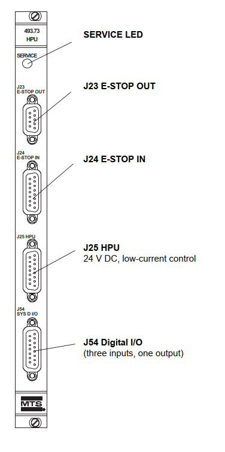


#### 规格


#### J23 E-Stop输出连接

J23提供了一组急停触点信号，可以提供给外设使用。系统中的任意一个急停按钮都能触发该急停触点

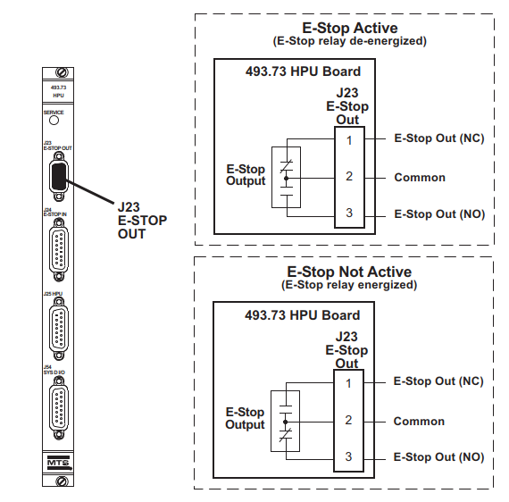

##### 电缆规格

为了保证电磁兼容性， J23 E-Stop的输出线缆必须符合以下规格：

**连接器** – 9针，D型连接器，母头，电磁兼容接头

**外壳** – 电子兼容 金属化塑料或金属外壳

**线缆**  - AWG和导体数量根据需求决定。织网型屏蔽层在机箱端与连接器外壳相连

#### J24 E-Stop输入连接

J24接头提供了一个外部急停的输入开关

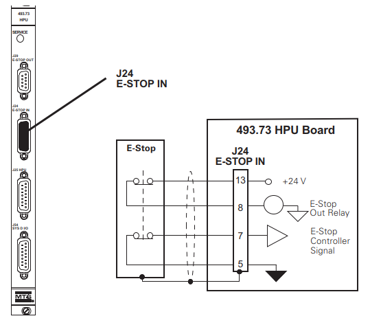

##### 电缆规格

为了保证电磁兼容性， J24 E-Stop的输入线缆必须符合以下规格：

**连接器** – 15针，D型连接器，母头，电磁兼容接头

**外壳** – 电子兼容 金属化塑料或金属外壳

**线缆**  -24 AWG 芯导线，织网型屏蔽层在机箱端与连接器外壳相连

##### 跳线

如果J24不使用，必须用跳线帽保证互锁网络的完整性。跳线帽的编号为039-713-201或短接针脚 5-7；8-13


#### J25 HPU连接

J25接头提供了一个用于控制液压泵站的24V逻辑信号，该接头能够直接与MTS 505系列HPU直接连接，或其它兼容低电流(<8mA)，24V控制逻辑的泵站相连.

##### 电缆规格

为了保证电磁兼容性， J25 HPU控制线缆必须符合以下规格：

**连接器** – 15针，D型连接器，母头，电磁兼容接头

**外壳** – 金属外壳

**线缆**  -32 AWG 9芯导线，织网型屏蔽层在机箱端与连接器外壳相连

##### 跳线

如果J25不使用，必须用跳线帽保证互锁网络的完整性。跳线帽的编号为039-713-301或短接针脚 1-7；2-3-5；6-9；8-10-11-12

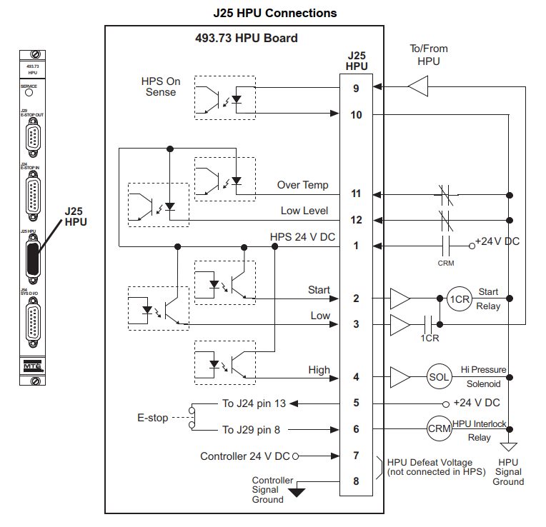


#### J54 DIO连接

**J54 SYS DI/O** 接口提供了三个数字输入和一个数字输出。数字输入使用光耦进行隔离，并带有防抖电路（与机械开关配合）

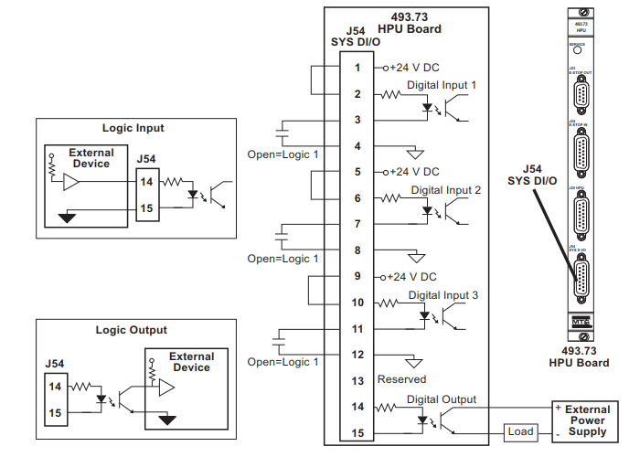

##### 电缆规格

为了保证电磁兼容性， J25 HPU控制线缆必须符合以下规格：

**连接器** – 15针，D型连接器，母头，电磁兼容接头

**外壳** – 金属外壳

**线缆**  - AWG和导线数量按需选择，织网型屏蔽层在机箱端与连接器外壳相连

#### UPS连接（FT60， FT100， FT200）

下图表明了UPS与493.73 HPU板卡之间的连接关系。在连接后，可以通过控制器软件添加UPS硬件资源，并配置选项。

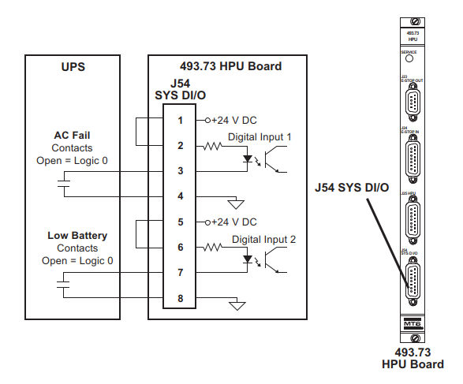

##### 电缆规格

为了保证电磁兼容性， J25 HPU控制线缆必须符合以下规格：

**连接器** – 15针，D型连接器，母头，电磁兼容接头

**外壳** – 金属外壳

**线缆**  - 24 - 26 AWG 和4芯导线，织网型屏蔽层在机箱端与连接器外壳相连


#### 493.74 双站台 HSM 接口板


#### 493.80 编码器转接板


#### 494.74 双站台 HSM 接口板


#### 494.75 8输入通道BNC转接板


#### 494.76 8输出通道BNC转接板


#### 494.79 8通道伺服阀驱动板


#### 493.07 HPU转接板